<h1 align="center">
    
    Kinozal Bot & News
    
</h1>

<p align="center">
    <a href="https://github.com/Lifailon/Kinozal-Bot/releases"></a>
    <a href="https://github.com/Lifailon/Kinozal-Bot"></a>
    <a href="https://github.com/Lifailon/Kinozal-Bot/blob/rsa/LICENSE"></a>
</p>

<p align="center">
    <a href="https://t.me/kinozal_news"></a>
</p>

Telegram бот, который позволяет автоматизировать процесс доставки контента до вашего телевизора, используя только телефон.

С помощью бота вы получите привычный и удобный интерфейс для взаимодействия с торрент трекером [Кинозал](https://kinozal.tv), а также возможность управлять торрент клиентом [qBittorrent](https://github.com/qbittorrent/qBittorrent) или [Transmission](https://github.com/transmission/transmission) на вашем компьютере, находясь удаленно от дома. В отличии от других приложений, предназначенных для удаленного управления торрент клиентами, **вам не нужно находиться в той же локальной сети** или использовать VPN.

💡 На базе бота реализован новостной канала 📢 [Kinozal-News](https://t.me/kinozal_news), который генерирует посты на основе новых публикаций в торрент трекере **[Кинозал](https://kinozal.tv)** с фильтрацией по **рейтингу (7.0+)** и **году выхода (2023+)**. Каждый пост содержит краткую информацию о раздаче (год выхода, страна производства, рейтинг, качество и перевод), а также `#хештеги` по жанру для фильтрации контента на канале и кнопки с ссылками описания фильма или сериала в базах данных о кинематографе [Кинопоиск](https://www.kinopoisk.ru) и [IMDb](https://www.imdb.com), бесплатный онлайн просмотр через плееры ▶️ [Kinobox](https://kinobox.tv) и 🧲 [магнитные ссылки](https://en.wikipedia.org/wiki/Magnet_URI_scheme) для прямой загрузки содержимого раздачи в вашем торрент клиенте по умолчанию (применимо как для bittorrent-клиентов на телефоне, так и Windows или Linux).

### 💁‍♂️ Как это работает?

Например, пока вы едите домой с работы, у вас появляется возможность подобрать фильм или сериал в обширной базе Кинозал прямиком с вашего телефона, или найти что-то новое на канале [Kinozal-News](https://t.me/kinozal_news), после чего сразу загрузить его на ваш компьютер и автоматически или через бот синхронизируете данные с [Plex Media Server](https://www.plex.tv/ru/media-server-downloads). По приходу домой, вам остается только открыть приложение Plex на вашем телевизоре и начать просмотр 📺🍿.

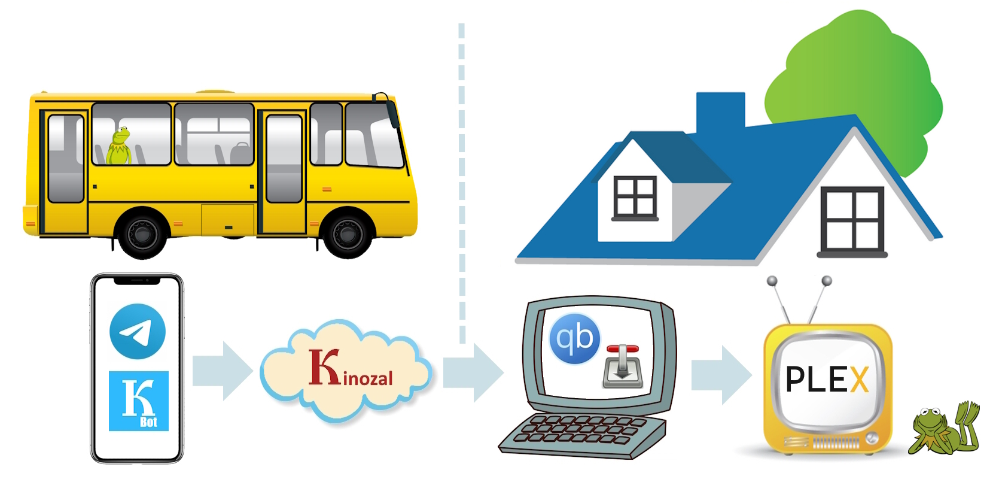

Также удобно использовать бот, что бы передать управление другому члену семьи, особенно, если у вас один компьютер, который может быть занят или к нему нет прямого доступа. Разобраться в интерфейсе бота проще, чем использовать все сервисы по отдельности, и главное куда быстрее.

💁‍♂️ Протестирован и работает в виртуальной среде **Hyper-V / VMWare** на системе **Debian 10.13 / Ubuntu 20.04 и выше** (возможен запуск на системе Windows через интерпретатор **Git Bash** или **MobaXterm**) для удаленного управления приложениями, установленные в домашней системе Windows или Linux*. Хранение торрент-файлов происходит в системе, на которой запущен бот.

### 🍿 Реализовано:

- ✅ Интерфейс для взаимодействия с торрент трекером **[Кинозал](https://kinozal.tv)**. Поиск раздач с фильтрацией по году выхода и формату разрешения, поиск фильмографии по актеру, получение подробной информации о раздачах, содержимое раздачи и загрузка торрент файлов.
- ✅ Централизованное управление загруженными торрент файлами (`.torrent`), с возможностью выгрузки в Telegram.
- ✅ Интерфейс для удаленного управления вашем торрент клиентом [qBittorrent](https://github.com/qbittorrent/qBittorrent). Добавление раздач на загрузку из торрент файла и [инфо хеш](https://en.wikipedia.org/wiki/Magnet_URI_scheme) (передается в каждой публикации новостного канала и при поиске раздач в боте), получение подробной информацию (скорость загрузки, статус, пиры, сиды и т.д.), пауза и возобновление загрузки, проверка на целостность, переключение лимитов скорости, управление приоритетом отдельных файлов, удаление торрента и содержимого раздачи в системе.
- ✅ Синхронизация контента с [Plex Media Server](https://www.plex.tv), а также просмотр содержимого директорий и дочерних файлов.

🧲 Добавление торрента по хэшу возможно из любого источника (торрент трекера). По мимо загрузки, это также дает возможность сформировать и сохранить торрент файл на сервере с полученными метаданными через торрент клиент qBittorrent, который можно выгрузкой в Telegram, для дальнейшей загрузки через ваш торрент клиент на телефоне, который не всегда способен получить метаданные.

### 📚 Stack:

- [Telegram api](https://core.telegram.org/bots/api);
- [qBittorrent api](https://github.com/qbittorrent/qBittorrent/wiki/WebUI-API-(qBittorrent-4.1));
- Plex Media Server api (не содержит официальной документации).

**Зависимости:**

- [jq](https://github.com/jqlang/jq) для обработки данных в формате *json*.
- Клиентское приложение **VPN и/или Proxy-сервер** для доступа в Кинозал (*опционально*).

---

## 🎉 Примеры использования

- Загрузка раздачи из канала по 🧲 магнитной ссылки (переадресация происходит автоматически в торрент клиент по умолчанию):

💡 Так как параметр url в [keyboard Telegram API](https://core.telegram.org/bots/api#inlinekeyboardmarkup) не поддерживает магнет ссылки, был реалезован механизм переадресации через [magnet2url](https://github.com/Lifailon/magnet2url), который добавляет в ссылку список актуальных серверов торрент трекеров.

<h1 align="center">
</a> 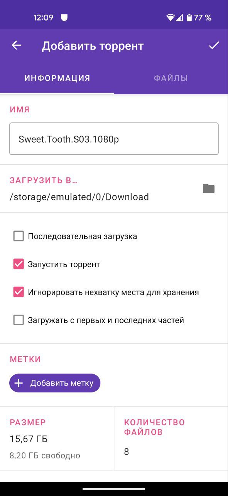</a>
</h1>

🚀 Быстрее всего (в течение 1-2 секунд с момента перехода по ссылке) метаданные подгружает локальный клиент [LibreTorrent](https://github.com/proninyaroslav/libretorrent) на Android и десктопный клиент [WebTorrent](https://github.com/webtorrent/webtorrent-desktop) на Windows, в то время как qBittorrent и Transmission может понадобиться до нескольки минут, при этом загрузка может происходить медленнее или вовсе не начаться.

<h1 align="center">
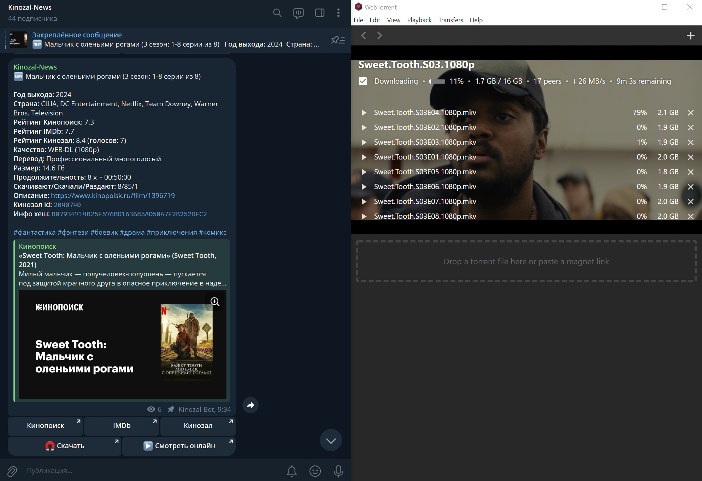</a>
</h1>

- Демонстрация работы поиска и добавление на загрузку в qBittorrent:

<h1 align="center">
</a>
</h1>

- 🔍 Поиск в торрент трекере c фильтрацией по году выхода и формату разрешения:

<h1 align="center">
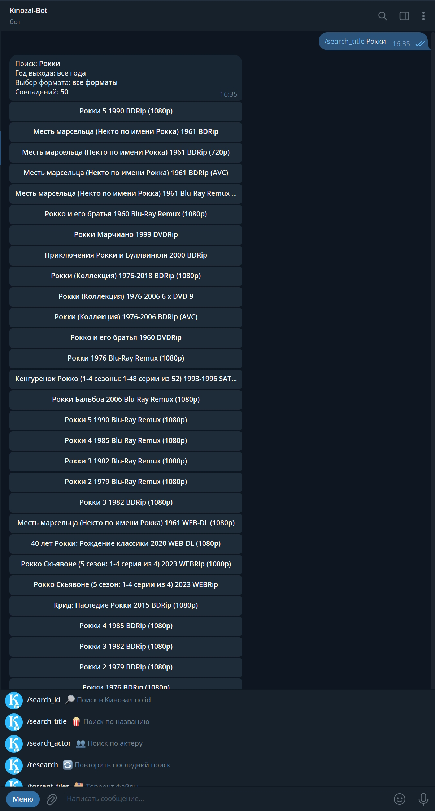</a> 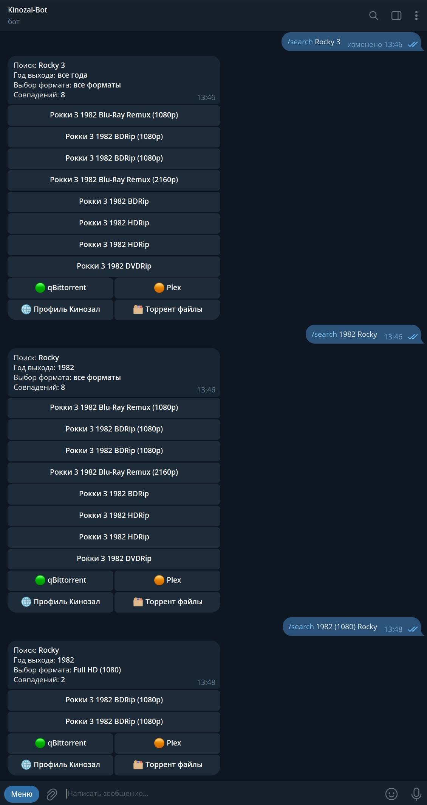</a>
</h1>

- Профиль Кинозал, список торрент файлов на сервере и выгрузка всех торрент файлов (с полученными метаданными) в Telegram:

<h1 align="center">
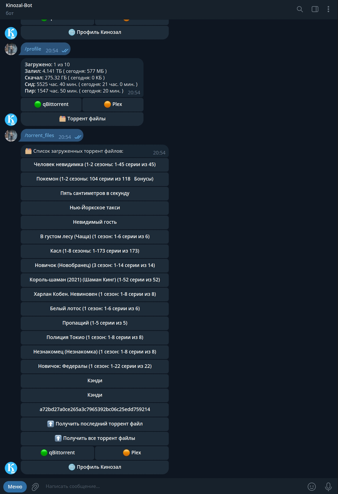</a> 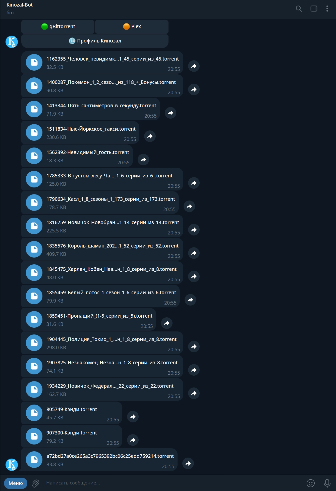</a>
</h1>

- Список всех активных торрентов, добавленных в клиент qBittorrent, статус выбранной раздачи и поиск выбранной раздачи в базе Кинозал:

<h1 align="center">
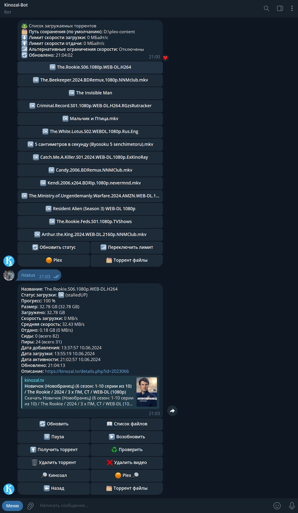</a> 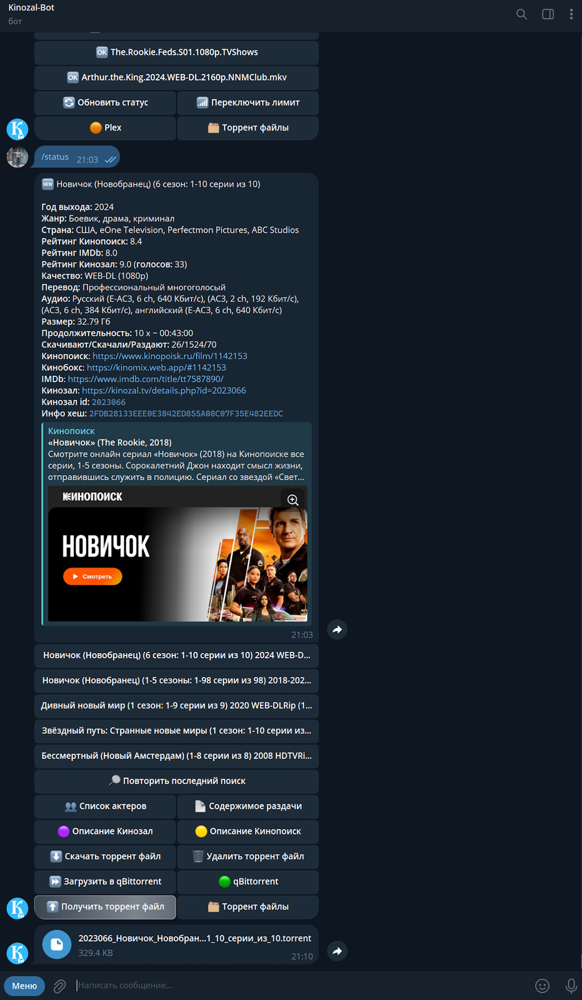</a>
</h1>

- Содержимое торрента (список файлов) для изменения приоритезацией загрузки и управление контентом в Plex. 

<h1 align="center">
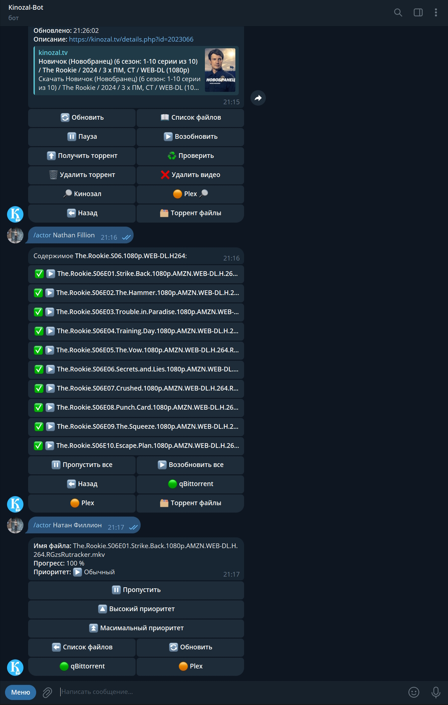</a> 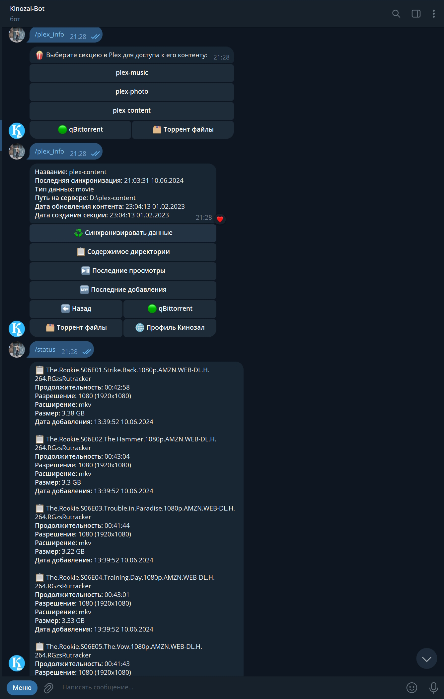</a>
</h1>


---

## ⚙️ Настройка

Для работы бота, необходимо подготовить свою среду, все настройки подключения задаются в конфигурационном файле: 📑 **[kinozal-bot.conf](https://github.com/Lifailon/Kinozal-Bot/blob/rsa/scripts/kinozal-bot.conf)**.

1. Зарегистрируйте аккаунт на сайте [Кинозал](https://kinozal.tv) и заполнить параметры конфигурации:

`KZ_PROFILE="id_you_profile"` - используется для получения информации из профиля Кинозал \
`KZ_USER="LOGIN"` - используется на этапе получения инфо хэш из раздачи и загрузки торрент-файлов \
`KZ_PASS="PASSWORD"`

2. Если у вас заблокирован доступ в Кинозал, вы можете воспользоваться VPN или Proxy, через который бот сможет проксировать свои запросы.

> Я использую **HandyCache** на системе Windows, рядом с которым запущена бесплатная версия **VPN Hotspot Shield** в режиме раздельного туннелирования (Split Tunneling) до сайта Кинозал.

`PROXY="True"` - включить использование прокси сервера в curl-запросах при обращении к Кинозал \
`PROXY_ADDR="http://192.168.3.100:9090"` - адрес сервера и порт, на котором слушает запросы Proxy-сервер \
`PROXY_USER="LOGIN"` \
`PROXY_PASS="PASSWORD"`

3. Создать своего Telegram бота через **[@botfather](https://t.me/BotFather)** используя интуитивно понятный интерфейс и получите API-токен доступа. Что бы получить ваш **чат id**, напишите любое сообщение вашему боту и перешлите его **[Get My ID](https://t.me/getmyid_arel_bot)**, после чего заполните параметры:

`TG_TOKEN="6873341222:AAFnVgfavenjwbKutRwROQQBya_XXXXXXXX"` - используется для чтения и отправки сообщений ботом \
`TG_CHAT="8888888888,999999999"` - id всех чатов, которые будут иметь доступа к боту. 

> В дальнейшем id можно получить в логе из запросов новых клиентов, которые вы сможете добавить в конфигурацию через запятую.

4. Установите и настройте торрент клиент [qBittorrent](https://www.qbittorrent.org/download).

- 4.1. Включите **Веб-интерфейс** в настройках приложения:

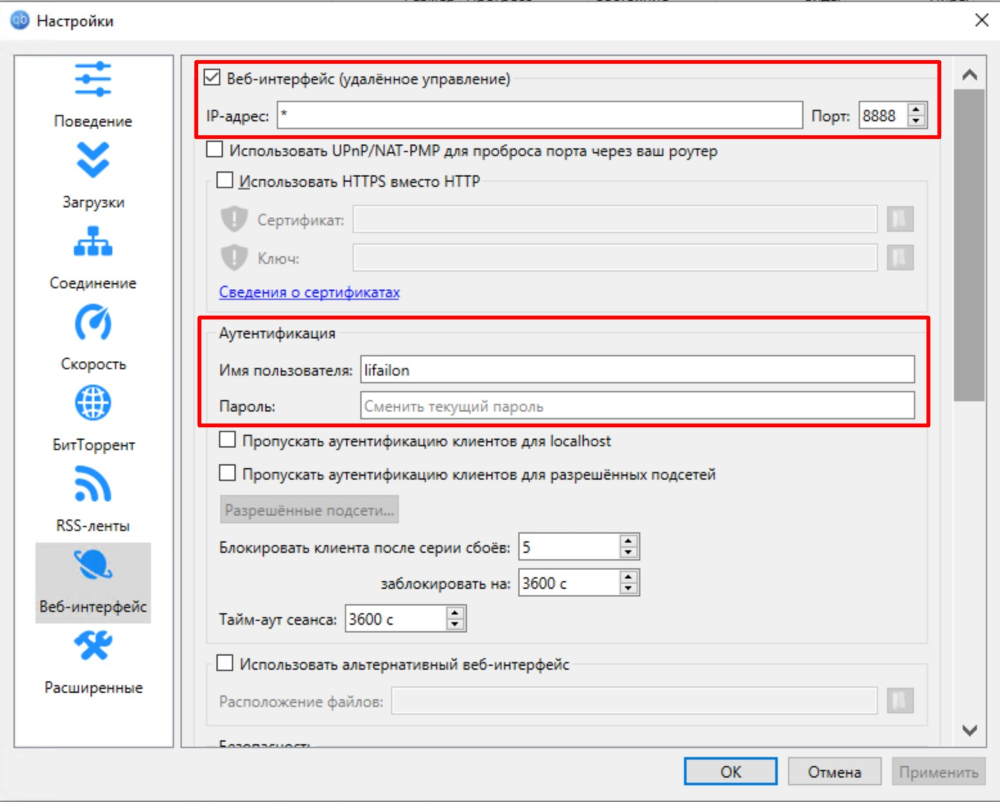

Укажите параметры подключения к клиенту:

`QB_ADDR="http://192.168.3.100:8888"` - указать URL-адрес, где указан протокол (по умолчанию, **http**), ip-адрес машины, на которой запущен qBittorrent и порт (задается в настройках **Веб-интерфейса**) \
`QB_USER="LOGIN"` - указывается в поле **Аутентификация** в настройках **Веб-интерфейса** \
`QB_PASS="PASSWORD"` - указывается в поле **Аутентификация** в настройках **Веб-интерфейса**

- 4.1. Определите директорию для загрузки контента в qBittorrent по умолчанию. 

💡 Это должна быть директория, которая будет добавлена на сервер Plex, что бы в дальнейшем можно было синхронизировать загруженный контент, используя бот.

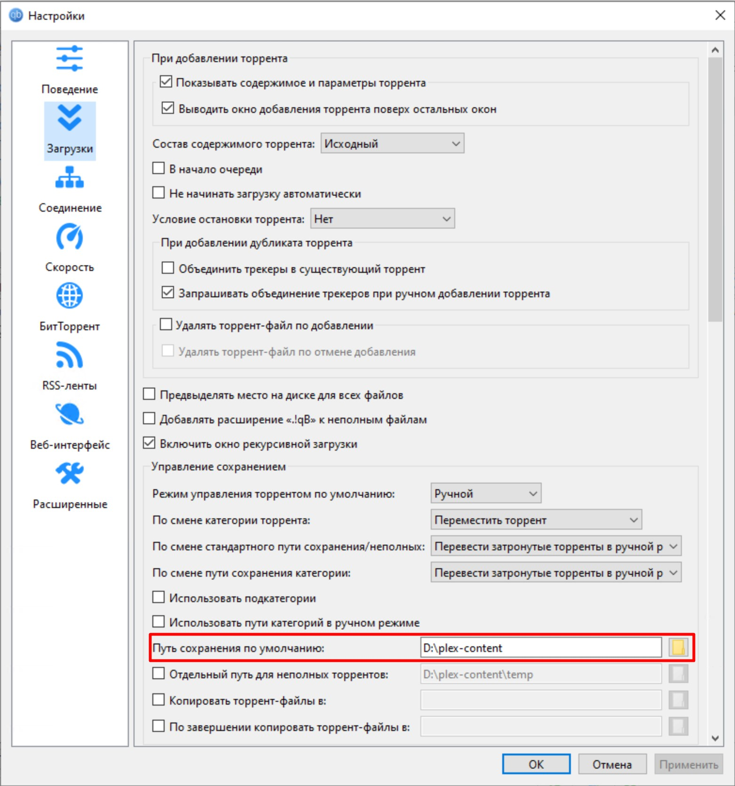

5. Установить [Plex Media Server](https://www.plex.tv/ru/media-server-downloads/?cat=computer&plat=windows) и [получить токен доступа](https://support.plex.tv/articles/204059436-finding-an-authentication-token-x-plex-token).

Так как нет возможности напрямую получить токент доступа в веб-интерфейсе, можно воспользоваться панелью разработчика ([Development Tools](https://developer.chrome.com/docs/devtools?hl=ru)) в браузере. Перейдите на вкладку **сеть (network)** и обновите страницу интерфейса вашего сервера Plex, после чего вы сможете увидеть токен в любом из url-запросов (X-Plex-Token=**ваш_токена**). Передайте адрес сервера (по умолчанию, порт **32400**) и содержимое токена в параметры:

```
PLEX_ADDR="http://192.168.3.100:32400"
PLEX_TOKEN="ваш_токена"
```

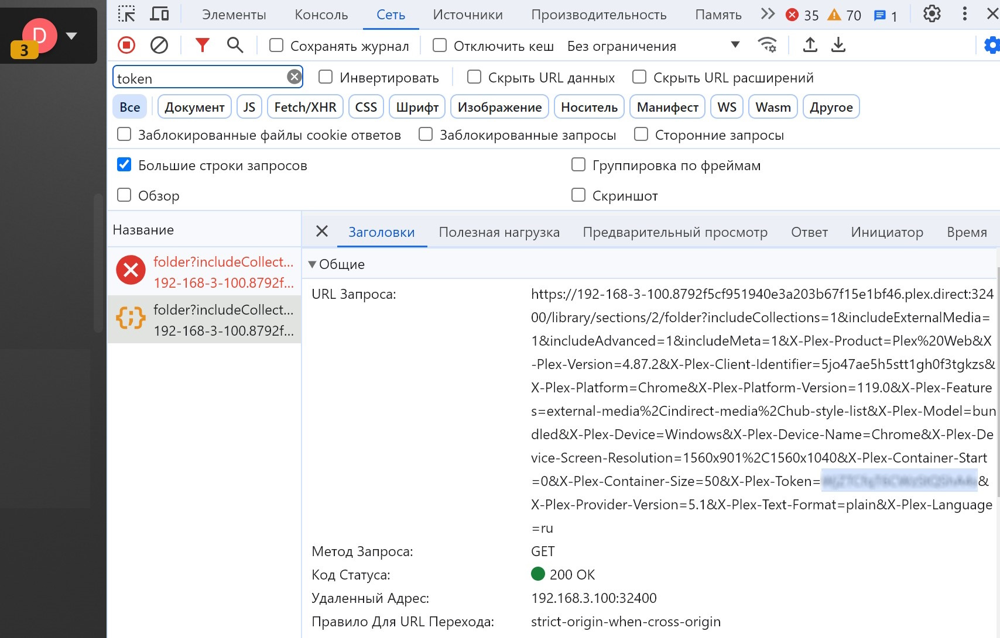

💡 Создайте новую секцию на сервере Plex и укажите путь к директории хранения вашего контента, на которую уже **настроен клиент qBittorrent по умолчанию**:

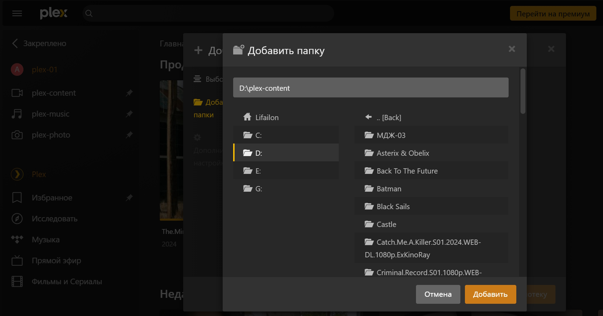

6. Пути для сохранения торрент файлов, cookie (временные файлы, для авторизации в qBittorrent и Кинозал), а также лог-файлов **задаются в конфигурации**.

```
path="/home/lifailon/kinozal-torrent"
path_qb_cookies="/home/lifailon/kinozal-torrent/qbittorrent.cookies"
path_kz_cookies="/home/lifailon/kinozal-torrent/kinozal.cookies"
path_log="/home/lifailon/kinozal-torrent/kinozal-bot.log"
log_size_mbyte=10
```

Все запросы к боту, а также его ответы логируются.

## 🐧 Запуск

Проверьте, что у вас установлен **[jq](https://github.com/jqlang/jq)**:

```bash
apt install jq
jq --version
jq-1.6
```

Для запуска бота [загрузите](https://github.com/Lifailon/Kinozal-Bot/tree/rsa/scripts) скрипт `kinozal-bot-*.sh` последней версии, и расположите предварительно настроенный конфигурационный файл **kinozal-bot.conf** рядом со скриптом.

Я использую директорию `kinozal-bot` в корне домашнего каталога текущего пользователя, вот пример состава файлов:

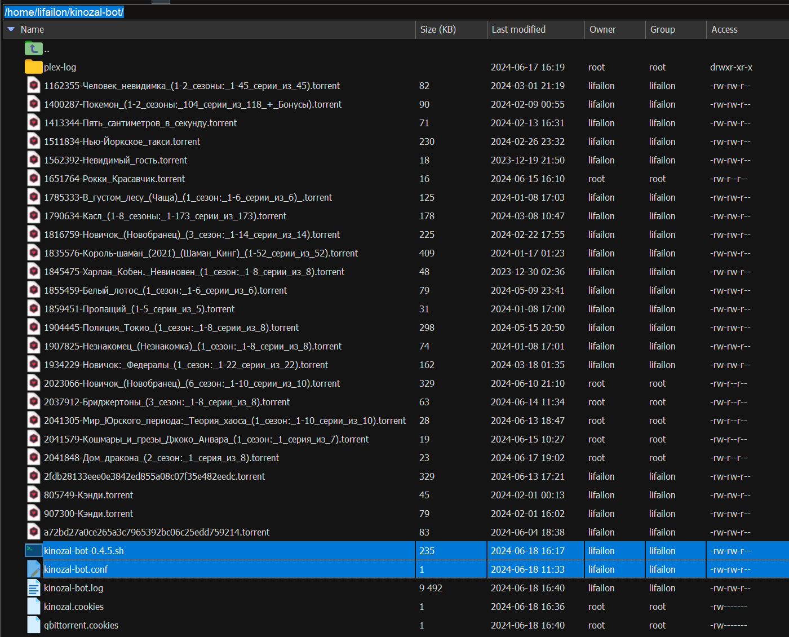

- Используйте интерпретатор 🐧 **Bash** для запуска (**root** права не требуются):

```bash
cd ~/kinozal-torrent
bash kinozal-bot-0.4.4.sh start bot
```

- Узнать статус работы и количество активных процессов:

```bash
bash kinozal-bot-0.4.4.sh status
bash kinozal-bot-0.4.4.sh status proc
```

- Проверка подключения к qBittorrent:

Если настройки заданы правильно, вы можете отобразить журнал работы qBittorrent клиента и сервера Plex в своей консоли.

```bash
bash kinozal-bot-0.4.4.sh log qb
bash kinozal-bot-0.4.4.sh log qb all
```

- Отобразить журнал работы системы и сервера Plex:

```bash
bash kinozal-bot-0.4.4.sh log plex system
bash kinozal-bot-0.4.4.sh log plex system all
bash kinozal-bot-0.4.4.sh log plex server
bash kinozal-bot-0.4.4.sh log plex server all
```

- Вывести журнал работы бота:

```bash
bash kinozal-bot-0.4.4.sh log bot   
bash kinozal-bot-0.4.4.sh log bot 50
```

- Остановить бота и все его дочерние процессы:

```bash
bash kinozal-bot-0.4.4.sh stop
bash kinozal-bot-0.4.4.sh status
```

## 🚀 Служба

Если все настройки заданы и подключение проверено, можно запустить бота как службу **systemd**, что бы автоматизировать процесс запуска в случае перезагрузки системы или другого сбоя, а также передать поток логов в системный журнал.

- Создайте файл службы и откройте его в любом текстовом редакторе:

```
touch /etc/systemd/system/kinozal-bot.service
nano /etc/systemd/system/kinozal-bot.service
```

- Скопируйте туда следующее [содержимое](https://github.com/Lifailon/Kinozal-Bot/blob/rsa/service/kinozal-bot.service):

```
[Unit]
Description=Telegram bot for kinozal.tv torrent tracker, remote managment qBittorrent and Plex Media Server
After=network.target

[Service]
ExecStart=/bin/bash "/home/lifailon/kinozal-torrent/kinozal-bot-0.4.4.sh" start bot log
ExecReload=/bin/kill -HUP $MAINPID
Restart=on-failure
Type=forking

[Install]
WantedBy=multi-user.target
```

💡 Замените путь к скрипту сервера в параметре запуска `ExecStart` на свой.

- Примените настройки, включите автозапуск и запустите бота:

```bash
systemctl daemon-reload
systemctl enable kinozal-bot
systemctl start kinozal-bot
systemctl status kinozal-bot
```

После этого возможно управлять запуском, используя команды: `start`, `stop` и `restart`.

Для просмотра журнала работы бота, можете использовать утилиту `journalctl`:

```bash
journalctl -fu kinozal-bot
```

---

## 📌 Команды

💁‍♂️ Список всех доступных команд (за исключением `/search`) автоматизированы через меню кнопок **keyboard**.

`/search` - Поиск в Кинозал по названию (вначале запроса принимает год выхода для фильтрации) \
`/profile` - Профиль Кинозал (количество доступных для загрузки торрент файлов, статистика загрузки и отдачи, время сид и пир) \
`/torrent_files` - Список загруженных торрент файлов с возможностью удаления \
`/status` -  список и статус всех текущих торрентов, добавленных в торрент-клиент qBittorrent \
`/plex_info` - Список секций на сервере Plex для доступа к их контенту \
`/download_torrent <id> <file_name>` - Загрузить торрент файл (передать два параметра: id и имя файла без пробелов) \
`/delete_torrent_file_<id>` - Удалить торрент файл по id \
`/find_kinozal <id>` - Поиск в Кинозал по id \
`/download_video_<id>` - Добавить торрент файла на загрузку в qBittorrent \
`/info <hash>` - Статус загрузки указанного торрента (передать параметр: hash торрента) \
`/torrent_content <hash>` - Содержимое торрента (список файлов) \
`/file_torrent <index>` - Статус выбранного торрент файла (передать параметр: порядковый индекс файла) \
`/torrent_priority <num>` - Изменить приоритет выбранного файла в /file_torrent (передать параметр: номер приоритета) \
`/pause <hash>` - Установить на паузу \
`/resume <hash>` - Восстановить загрузку \
`/delete_torrent <hash>` - Удалить торрент из клиента \
`/delete_video <hash>` - Удалить вместе с данными \
`/plex_status_<key>` - Информация о выбранной секции в Plex (передать параметр: ключ секции) \
`/plex_sync_<key>` - Синхронизировать выбранную секцию в Plex \
`/plex_folder_<key>` - Получить список директорий и файлов в выбранной секции \
`/find` - Поиск контента в Plex по пути (передать параметр: конечную точку)

### Добавлено в версии 0.4.1:

`/plex_last_views` - Список последних просмотров (дата просмотра и время остановки) в Plex \
`/plex_last_added` - Список последних добавленных файлов в Plex \
`/kinozal_description <id>` - Описание фильма из Кинозал (передать параметр: id kinozal)

### Добавлено в версии 0.4.2:

`/kinozal_actors <id>` - Список актеров из Кинозал (передать параметр: id kinozal) \
`/actor <id>` - Описание, поиск актера и его фильмографии из Кинозала и ссылка на Кинопоиск (передать параметр: имя актера) \
`/kinopoisk_movie <id>` - Информация о фильме из Кинопоиск по id kinopoisk (передать параметр: id kinozal)

### Добавлено в версии 0.4.4:

`/search <year*> <format*> <title>` - Поиск с фильтрацией по году выхода и формату разрешения \
`/research` - Повторить последний поиск (id не требуется) \
`/file_list` - Извлечь список файлов и их размер из раздачи \
`/send_torrent_file_id` - Отправка загруженного торрент-файла в Telegram \
`/send_last_torrent_file` - Отправить последний загруженный торрент-файл \
`/send_all_torrent_files` - Отправить все загруженные торрент-файлы \
`/skip_all_files <hash>` - Пропустить загрузку всех файлов путем изменения приоритета в qBittorrent \
`/normal_all_files <hash>` - Восстановить загрузку всех файлов \
`/add_torrent <hash>` - Добавить раздачу на загрузку в qBittorrent по инфо хэш \
`/get_torrent <hash>` - Выгрузить торрент файл на сервер по инфо хэш и отправить в телеграмм \
`/torrent_recheck <hash>` - Проверить торрент файл \
`/torrent_limit` - Переключить альтернативные лимиты скорости загрузки и отдачи

## 🔍 Примеры команд поиска

- Поиск в Кинозал по id:

```
/find_kinozal 1940284
```

- Поиск по названию фильма или сериала:

```
/search Рокки 2
/search Рокки 4
```

- Поиск с фильтрацией по году выхода:

```
/search 1979 Рокки
/search 1985 Рокки
```

- Поиск с фильтрацией по формату разрешения:

```
/search (720) Рокки
/search (1080) Рокки
/search (2160) Рокки
```

- Поиск с фильтрацией по формату разрешения и году выхода:

```
/search 1985 (2160) Рокки
/search (2160) 1985 Рокки
```

- Поиск фильмографии по имени актера (получить список фильмов из Кинозал):

```
/actor Сильвестр Сталлоне
```

- Неверный поиск (находит только актера в Кинопоиск по api без фильмографии):

```
/actor сильвестр сталлоне
/actor Сильвестр Сталоне
```

- Повторить последний запрос поиска (для фильма/сериала или актера):

```
/research
```

- Добавить торрент по инфо хэш в qBittorrent на загрузку:

```
/add_torrent A72BD27A0CE265A3C7965392BC06C25EDD759214
```

---

## Change log

### 12.06.2024 (0.4.4):

- Изменены параметры управления запуска (2 режима) и возможность настройки управления чере службу systemd;
- Добавлены параметры вывода логов бота, журнала работы клиента qBittorrent и сервера Plex;
- Добавлено получение инфо хеш каждой раздачи и содержимое раздачи (/file_list из /find_kinozal);
- Повторить последний поисковой запрос (доступно из меню и /find_kinozal);
- Фильтрация по формату (разрешению) при поиске по названию фильма или сериала;
- Получение последнего, выбранного и всех загруженных торрент файлов с сервера (отправка в телеграм);
- Добавлена возможность загрузить торрент по инфо хэш (/add_torrent из меню);
- Выгрузить торрент файла из клиента qBittorrent (после загрузки метаданных) на сервер с отправкой в телеграм;
- Добавлена проверка (сканирование целостности) торрент раздачи в qBittorrent;
- Добавлен статус приоритета и загрузки в списке файлов выбранного торрента;
- Добавлен пропуск и восстановление загрузки всех файлов в qBittorrent;
- Добавлен поиск в Plex из qBittorrent по имени файла (из /info <name> в /find <name>);
- Добавлена информация о настройках и лимитах qBittorrent в список торрентов (/status) и переключение на альтернатывные лимиты скорости (/torrent_limit);
- Исправлено: обновление статуса после синхронизации контента Plex, добавлено время обновления, что бы отвисала кнопка, где может не обновляться контент;
- Канал: добавлены хэштеги по жанру и кнопки для перехода по url (Кинопоиск + IMDb + Кинозал + Magnet + Kinobox);
- Обновлен парсинг и добавлены условия для проверки на наличие содержимого в описание постов;
- Добавлен redirect с url https на magnet uri для перенаправления в торрент клиент по умолчанию, т.к. магнитные ссылки не принимает Telegram для передачи в url;
- Добавлены функции qBittorrent для получения списка трекеров, содержимого RSS ленты и работы с поисковыми плагинами (Search Plugins).

## Backlog

- Добавить [Everything api](https://www.voidtools.com) для выгрузки видеофайлов в Telegram;
- Поддержка [обратного прокси сервера](https://github.com/Lifailon/ReverseProxyNET);
- Отладить получение информации по актеру;
- Поддержка других торрент клиентов (например, Transmission);
- Заменить Kinopoisk unofficial API на [TMDB api](https://developer.themoviedb.org/reference/intro/getting-started);
- Получить список плееров через [Kinobox api](https://kinobox.tv) и трейлеров через YouTube;
- Получить список выхода серий через внешние сервисы ([Toramp](https://toramp.com), [MyShows](https://myshows.me) или [Film.ru](https://film.ru)).