<h1 align="center">
    
    Kinozal Bot & News
    
</h1>

<p align="center">
    <a href="https://github.com/Lifailon/Kinozal-Bot/releases"></a>
    <a href="https://github.com/Lifailon/Kinozal-Bot"></a>
    <a href="https://github.com/Lifailon/Kinozal-Bot/blob/rsa/LICENSE"></a>
</p>

<p align="center">
    <a href="https://t.me/kinozal_news"></a>
</p>

Telegram бот, который позволяет автоматизировать процесс доставки контента до вашего телевизора, используя только телефон.

С помощью бота вы получите привычный и удобный интерфейс для взаимодействия с торрент трекером [Кинозал](https://kinozal.tv), а также возможность управлять торрент клиентом [qBittorrent](https://github.com/qbittorrent/qBittorrent) или [Transmission](https://github.com/transmission/transmission) на вашем компьютере, находясь удаленно от дома. В отличии от других приложений, предназначенных для удаленного управления торрент клиентами, **вам не нужно находиться в той же локальной сети** или использовать VPN.

💡 На базе бота реализован новостной канала 📢 [Kinozal-News](https://t.me/kinozal_news), который генерирует посты на основе новых публикаций в торрент трекере **[Кинозал](https://kinozal.tv)** с фильтрацией по **рейтингу (7.0+)** и **году выхода (2023+)**. Каждый пост содержит краткую информацию о раздаче (год выхода, страна производства, рейтинг, качество и перевод), а также `#хештеги` по жанру для фильтрации контента на канале и кнопки с ссылками описания фильма или сериала в базах данных о кинематографе [Кинопоиск](https://www.kinopoisk.ru) и [IMDb](https://www.imdb.com), бесплатный онлайн просмотр через плееры ▶️ [Kinobox](https://kinobox.tv) и 🧲 [магнитные ссылки](https://en.wikipedia.org/wiki/Magnet_URI_scheme) для прямой загрузки содержимого раздачи в вашем торрент клиенте по умолчанию (применимо как для bittorrent-клиентов на телефоне, так и Windows или Linux).

### 💁‍♂️ Как это работает?

Например, пока вы едите домой с работы, у вас появляется возможность подобрать фильм или сериал в обширной базе Кинозал прямиком с вашего телефона, или, найти что-то новое на канале [Kinozal-News](https://t.me/kinozal_news), после чего сразу загрузить выбранное на ваш компьютер и автоматически или через бот синхронизировать данные с [Plex Media Server](https://www.plex.tv/ru/media-server-downloads). По приходу домой, вам остается только открыть приложение Plex на вашем телевизоре и начать просмотр 📺🍿.


Такой подход также применим для передачи управления по подбору контента другому члену семьи, это особенно актуально, если у вас один компьютер, который может быть занят или к нему нет прямого доступа. Разобраться в интерфейсе бота проще, чем использовать все сервисы по отдельности, и главное, куда быстрее.

🔌 Протестирован и работает в виртуальной среде **Hyper-V / VMWare** на системе **Debian 10.13 / Ubuntu 20.04 и выше** (возможен запуск на системе Windows через интерпретатор **Git Bash** или **MobaXterm**) для удаленного управления приложениями, установленные в домашней системе Windows или Linux*. Хранение торрент-файлов происходит в системе, на которой запущен бот.

### 🍿 Реализовано:

- ✅ Интерфейс для взаимодействия с торрент трекером **[Кинозал](https://kinozal.tv)**. Поиск раздач с фильтрацией по году выхода и формату разрешения (*HD/FullDH/4K*), получение подробной информации о каждой раздачи, содержимое раздачи, загрузка торрент файлов, поиск актеров и его фильмографии
- ✅ Централизованное управление загруженными торрент файлами (*.torrent*) на сервере, с возможностью выгрузки в Telegram.
- ✅ Интерфейс удаленного управления торрент клиентом [qBittorrent](https://github.com/qbittorrent/qBittorrent). Добавление раздач на загрузку из торрент файла, [инфо хеш](https://en.wikipedia.org/wiki/Magnet_URI_scheme) (передается в каждой публикации новостного канала и при поиске раздач в боте) а также через url торрент файла, получение подробной информации о загрузке (скорость загрузки, статус, пиры, сиды и т.д.), пауза и возобновление загрузки, проверка на целостность, переключение лимитов скорости, управление приоритетом отдельных файлов, удаление торрента и содержимого раздачи в системе.
- ✅ Интерфейс управлени торрент клиентом [Transmission](https://github.com/transmission/transmission). Добавление раздач на загрузку из торрент файла, инфо хеш и url, получение подробной информации о загрузке, пауза и возобновление загрузки, управление приоритетом отдельных файлов, удаление торрента и содержимого раздачи в системе.
- ✅ Синхронизация контента с [Plex Media Server](https://www.plex.tv), а также просмотр содержимого директорий и дочерних файлов.
- ✅ Получение дополнительной информации о фильме и сериале из [The Movie Database](https://www.themoviedb.org/?language=ru) (TMDB). Список актеров и сезонов для каждого сериала, список серий в каждом сезоне, дата выхода серий, а также получение подробной информации о каждой серии и список приглашенных актеров.

Добавление торрента по 🧲 hash-сумме и 🌐 url-адресу торрент файла (без загрузки самого файла) возможно из любого источника (торрент трекера). По мимо загрузки, это также дает возможность сформировать и сохранить торрент файл на сервере с полученными метаданными через торрент клиент qBittorrent или Transmission, который можно выгрузкой в Telegram, для дальнейшей загрузки через ваш торрент клиент на телефоне.

### 📚 Stack:

- [Telegram api](https://core.telegram.org/bots/api);
- [qBittorrent WebUI api](https://github.com/qbittorrent/qBittorrent/wiki/WebUI-API-(qBittorrent-4.1));
- [Transmission RPC api](https://github.com/transmission/transmission/blob/main/docs/rpc-spec.md);
- Plex Media Server api (не содержит официальной документации);
- [TMDB api](https://developer.themoviedb.org/reference/intro/getting-started).

**Зависимости:**

- [jq](https://github.com/jqlang/jq) для обработки данных в формате *json*;
- Клиентское приложение **VPN** и/или **Proxy-сервер** для доступа в Кинозал (*опционально*).

Серверная часть написана на чистом [Bash](https://ru.wikipedia.org/wiki/Bash) и использует стандартный набор unix-утилит. Вы можете настроить и управлять любым торрент клиентом независимо от настройки или работоспособности трекера Кинозал.

---

## 🎉 Примеры использования

- Загрузка раздачи из канала по 🧲 магнитной ссылки (переадресация происходит автоматически в торрент клиент по умолчанию):

<h1 align="center">
</a> </a>
</h1>

💡 Так как параметр url в [keyboard Telegram API](https://core.telegram.org/bots/api#inlinekeyboardmarkup) не поддерживает magnet-ссылки, был реалезован механизм переадресации через [magnet2url](https://github.com/Lifailon/magnet2url), который также добавляет в ссылку список актуальных серверов торрент трекеров.

💡💡 Быстрее всего (в течение 1-2 секунд с момента перехода по ссылке) метаданные загружает локальный клиент [LibreTorrent](https://github.com/proninyaroslav/libretorrent) на Android и desktop клиент [WebTorrent](https://github.com/webtorrent/webtorrent-desktop) на Windows, в то время как qBittorrent и Transmission может понадобиться до нескольки минут, а также загрузка может происходить медленнее (в таком случае может помочь запрос большего количества участников у торрент трекера).

<h1 align="center">
</a>
</h1>

- Демонстрация работы поиска и добавление на загрузку в qBittorrent (версия 0.4.5):

<h1 align="center">
</a>
</h1>

- 🔍 Поиск в торрент трекере c фильтрацией по году выхода и формату разрешения:

<h1 align="center">
</a> </a>
</h1>

> Скорость получения информации из трекера Кинозал на прямую зависит от скорости работы вашего интернета и/или VPN соединения.

- 👤 Профиль Кинозал, список торрент файлов на сервере и выгрузка всех торрент файлов (с полученными метаданными) в Telegram:

<h1 align="center">
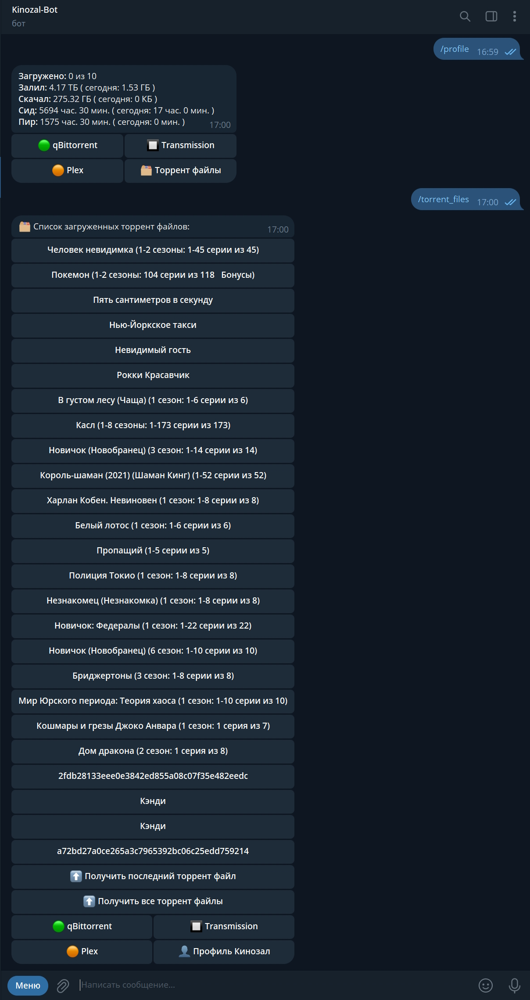</a> 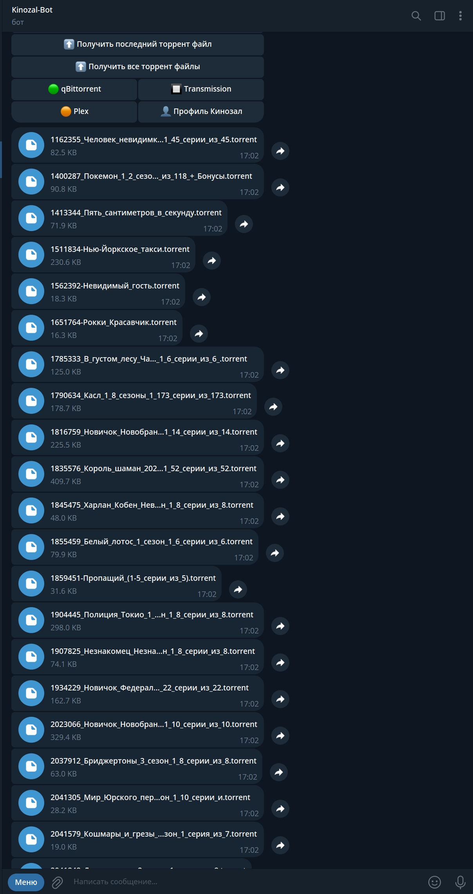</a>
</h1>

- 🍿 Получение информации о выбранном сериале в Кинозал (стандартный вывод для всех раздач), из данного интерфейса происходит управление выбранным торрент файлом, а также пример управления загрузкой в клиенте 🔳 Transmission:

<h1 align="center">
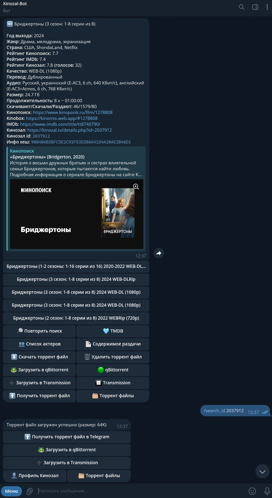</a> 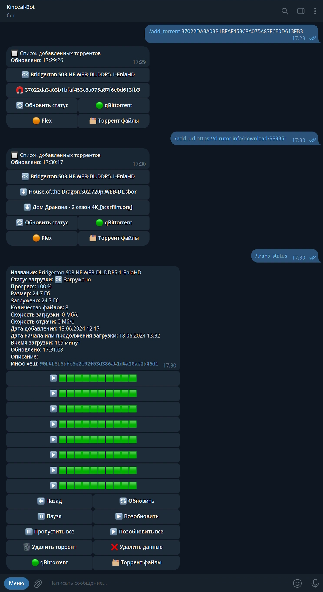</a>
</h1>

- 👥 Поиск по актеру в трекере Кинозал и список фильмов с его участием, а также получение дополнительной информации из базы 💙 TMDB и даты выхода всех сезонов и серий:

<h1 align="center">
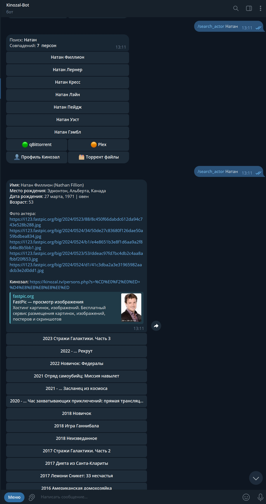</a> 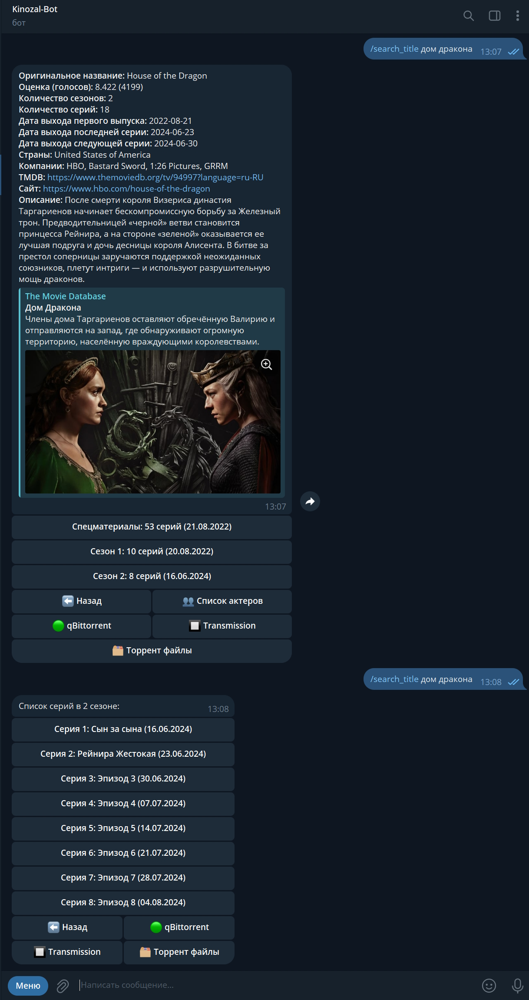</a>
</h1>

- 🐸 Список и статус всех активных торрентов, добавленных в клиент qBittorrent, а также получение дополнительной информации и управление загрукой файлов:

<h1 align="center">
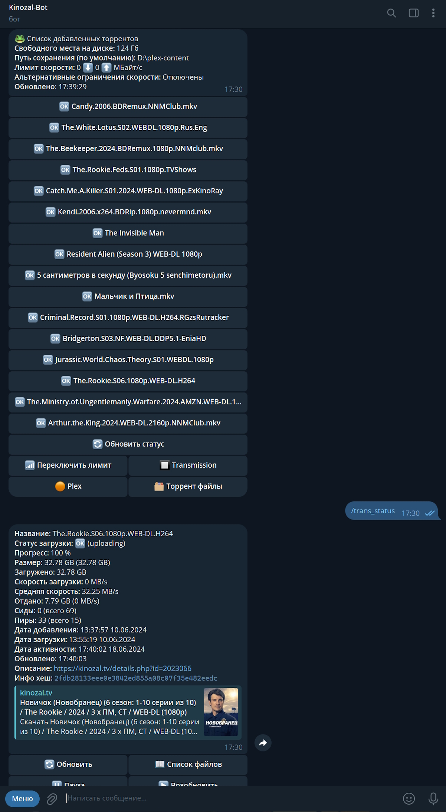</a> 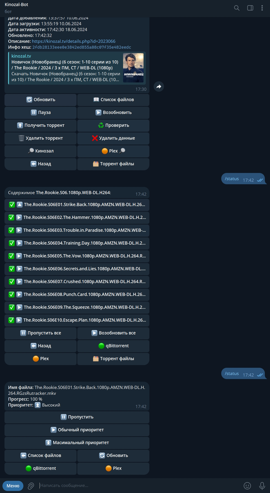</a>
</h1>

- 🟠 Список секций и синхронизация контента, а также просмотр содержимого файлов на сервере Plex:

<h1 align="center">
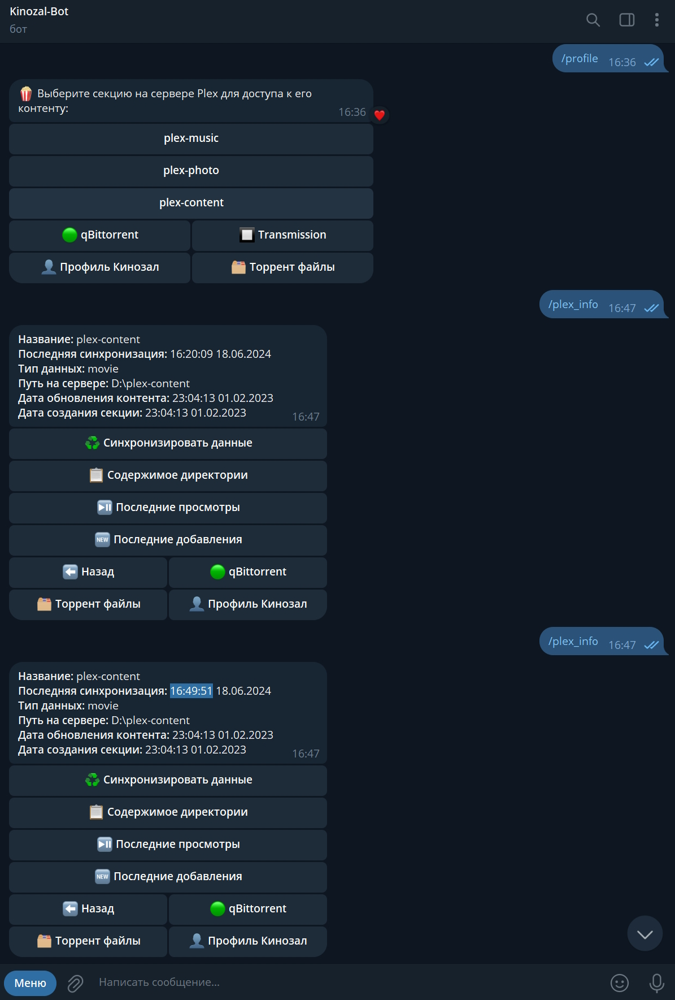</a> 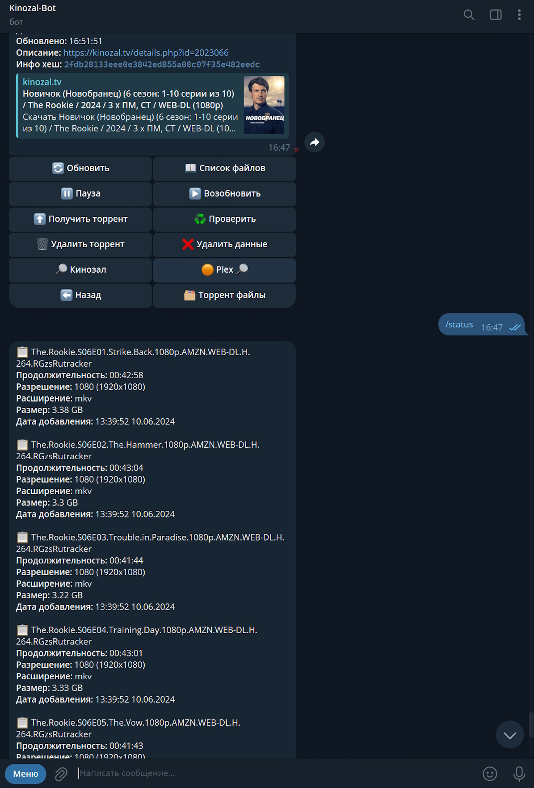</a>
</h1>

---

## ⚙️ Настройка

Для работы бота, необходимо подготовить свою домашнюю среду, все настройки подключения задаются в конфигурационном файле: 📑 **[kinozal-bot.conf](https://github.com/Lifailon/Kinozal-Bot/blob/rsa/scripts/kinozal-bot.conf)**.

1. Зарегистрируйте аккаунт на сайте [Кинозал](https://kinozal.tv) и заполнить параметры конфигурации:

`KZ_PROFILE="id_you_profile"` - идентификатор вашего профиля, используется для получения информации из профиля Кинозал \
`KZ_USER="LOGIN"` - логин, используется на этапе получения инфо хэш из раздачи и загрузки торрент-файлов \
`KZ_PASS="PASSWORD"` - пароль

2. Если у вас заблокирован доступ в Кинозал, вы можете воспользоваться VPN или Proxy сервером, через который бот сможет проксировать свои запросы.

> Я использую **HandyCache** на системе Windows, рядом с которым запущена бесплатная версия **VPN Hotspot Shield** в режиме раздельного туннелирования (Split Tunneling) до сайта Кинозал.

- 2.1. Настройка Proxy-сервера:

`PROXY="True"` - включить использование прокси сервера в curl-запросах при обращении к Кинозал \
`PROXY_ADDR="http://192.168.3.100:9090"` - адрес сервера и порт, на котором слушает запросы Proxy-сервер \
`PROXY_USER="LOGIN"` \
`PROXY_PASS="PASSWORD"`

- 2.2. Вы можете указать любой из адресов для доступа к Кинозал, используя зеркало:

```
KZ_ADDR="https://kinozal.tv"
```

или

```
KZ_ADDR="https://kinozal.me"
```

- 2.3. Возможен вариант использования обратного прокси сервер, у которого есть прямой доступ к трекеру, например, через [rpnet](https://github.com/Lifailon/ReverseProxyNET):

Скачайте [исполняемый файл](https://github.com/Lifailon/ReverseProxyNET/releases) и запустите обратный прокси сервер на машине с доступом к Kinozal:

```
rpnet.exe --local 192.168.3.100:8443 --remote https://kinozal.tv
```

Отключите в конфигурации использование Proxy-сервера и замените адрес Кинозал на адрес обратного прокси сервера:

```
PROXY="False"
KZ_ADDR="http://192.168.3.100:8443"
```

> ⚠️ **rpnet** не поддерживает авторизацию.

3. Создайте своего Telegram бота через **[@botfather](https://t.me/BotFather)** используя интуитивно понятный интерфейс и получите API-токен доступа. Что бы получить ваш **чат id**, напишите любое сообщение вашему боту и перешлите его **[Get My ID](https://t.me/getmyid_arel_bot)**, после чего заполните параметры:

`TG_TOKEN="6873341222:AAFnVgfavenjwbKutRwROQQBya_XXXXXXXX"` - используется для чтения и отправки сообщений ботом \
`TG_CHAT="8888888888,999999999"` - id всех чатов, которые будут иметь доступа к боту. 

> В дальнейшем id можно получить в логе из запросов новых клиентов, которые вы сможете добавить в конфигурацию через запятую.

4. [Установите](https://www.qbittorrent.org/download) и настройте торрент клиент qBittorrent.

- 4.1. Включите **Веб-интерфейс** в настройках приложения:

<h1 align="center">
</a>
</h1>

Укажите параметры подключения к клиенту:

`QB_ADDR="http://192.168.3.100:8888"` - указать URL-адрес, где указан протокол (по умолчанию, **http**), ip-адрес машины, на которой запущен qBittorrent и порт (задается в настройках **Веб-интерфейса**) \
`QB_USER="LOGIN"` - указывается в поле **Аутентификация** в настройках **Веб-интерфейса** \
`QB_PASS="PASSWORD"` - указывается в поле **Аутентификация** в настройках **Веб-интерфейса**

- 4.1. Определите директорию для загрузки контента в qBittorrent по умолчанию. 

💡 Это должна быть директория, которая будет добавлена на сервер Plex, что бы в дальнейшем можно было синхронизировать загруженный контент, используя бот.

<h1 align="center">
</a>
</h1>

5. [Установите](https://transmissionbt.com/download) и настройте Transmission для управления клиентом с помощью бота:

<h1 align="center">
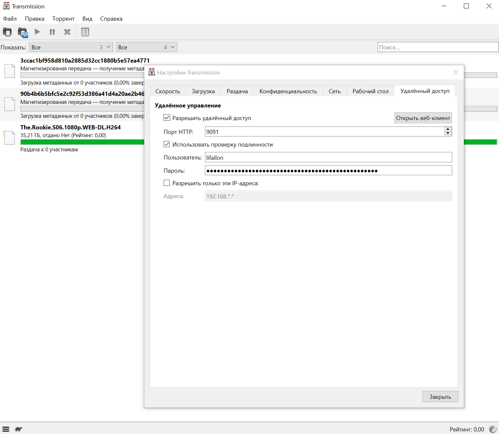</a>
</h1>

Укажите параметры подключения к клиенту:

```
TRANS_ADDR="http://192.168.3.100:9091"
TRANS_USER="LOGIN"
TRANS_PASS="PASSWORD"
```

💡☁️ Возможно использовать один (или оба) из поддерживаемых клиентов для синхронизации с сервером Plex, или, например, настроить **второй клиент для синхронизации с любым облачным хранилищем**, что бы иметь удаленный доступ к файлам, например, с телефона, т.к. для удаленной загрузки контента с сервера Plex требуется подписка [Plex Pass](https://www.plex.tv/plex-pass). Для этого укажите любую дочернюю директорию внутри вашего облачного хранилища (необходимо, что бы было настроено подключения облачного хранилища к вашей файловой системе) для загрузки контента в Transmission клиенте по умолчанию.

6. Установите [Plex Media Server](https://www.plex.tv/ru/media-server-downloads/?cat=computer&plat=windows) и [получите токен доступа](https://support.plex.tv/articles/204059436-finding-an-authentication-token-x-plex-token).

Так как нет возможности напрямую получить токент доступа в веб-интерфейсе, можно воспользоваться панелью разработчика [Development Tools](https://developer.chrome.com/docs/devtools?hl=ru) в браузере. Перейдите на вкладку **сеть (network)**, обновите страницу интерфейса вашего сервера Plex, после чего вы сможете увидеть токен в любом из url-запросов (X-Plex-Token=**ваш_токена**). Передайте адрес сервера (по умолчанию, порт **32400**) и содержимое токена в параметры:

```
PLEX_ADDR="http://192.168.3.100:32400"
PLEX_TOKEN="ваш_токена"
```

<h1 align="center">
</a>
</h1>

💡 Создайте новую секцию на сервере Plex и укажите путь к директории хранения вашего контента, на которую уже **настроен клиент qBittorrent по умолчанию**:

<h1 align="center">
</a>
</h1>

7. Пути хранения торрент файлов, cookie (временные файлы, для авторизации в qBittorrent и Кинозал), а также лог-файлов и размер (поддерживается ротация) **задаются в конфигурации**:

💡 Все запросы к боту, а также его ответы логируются

```
path="/home/lifailon/kinozal-bot"
log_size_mbyte=10
```

8. Настройка подключения к TMDB api:

💡 Как и в случае со вторым торрент клиентом, данный пункт является *опциональным*.

[Зарегестрируйте аккаунт](https://www.themoviedb.org/signup) на сайте **The Movie Database** и [выпустите ключ доступа](https://www.themoviedb.org/settings/api) к api, после чего заполните параметры конфигурации (возможно указать ключ или токен на выбор):

```
TMDB_KEY="XXXXXXXXXXXXXXXXXXXXXXXXXXXXXXXX"
TMDB_TOKEN="XXXXXXXXXXXXXXXXXXXX.XXXXXXXXXXXXXXXXXXXX.XXXXXXXXXXXXXXXXXXXX"
```

## 🐧 Запуск

#### Зависимости

Установите **[jq](https://github.com/jqlang/jq)**:

```bash
apt install jq
jq --version

jq-1.6
```

Для запуска бота [загрузите](https://github.com/Lifailon/Kinozal-Bot/tree/rsa/scripts) скрипт `kinozal-bot-*.sh` последней версии, и расположите предварительно настроенный конфигурационный файл **kinozal-bot.conf** рядом со скриптом.

В примере используется директория `kinozal-bot` в корне домашнего каталога текущего пользователя, так выглядит состав файлов на рабочем экземпляре:

<h1 align="center">
</a>
</h1>

#### Проверка подключения

Перед запуском, вы можете проверить подключение к сервисам, в случае успеха, вы получите текущую версию:

```bash
bash kinozal-bot/kinozal-bot-0.4.5.sh version

qBittorrent Client:  4.6.5 (api: 2.9.3)
Transmission Client: 4.0.6 (38c164933e)
Plex Media Server:   1.40.0.7998-c29d4c0c8
```

#### Управление

- Используйте интерпретатор 🐧 **Bash** для запуска (**root** права не требуются):

```bash
cd ~/kinozal-bot
bash kinozal-bot-0.4.5.sh start bot
```

- Узнать статус работы и количество активных процессов:

```bash
bash kinozal-bot-0.4.5.sh status

[INFO] 14:38:46: Server running. Count running process: 4
```

- Проверка подключения к qBittorrent:

Если настройки заданы правильно, вы можете отобразить журнал работы qBittorrent клиента и сервера Plex в своей консоли.

```bash
bash kinozal-bot-0.4.5.sh log qb
bash kinozal-bot-0.4.5.sh log qb all
```

- Отобразить журнал работы системы и сервера Plex:

```bash
bash kinozal-bot-0.4.5.sh log plex system
bash kinozal-bot-0.4.5.sh log plex system all
bash kinozal-bot-0.4.5.sh log plex server
bash kinozal-bot-0.4.5.sh log plex server all
```

- Вывести журнал работы бота:

```bash
bash kinozal-bot-0.4.5.sh log bot   
bash kinozal-bot-0.4.5.sh log bot 50
```

- Остановка бота и всех его дочерних процессов:

```bash
bash kinozal-bot-0.4.5.sh stop
bash kinozal-bot-0.4.5.sh status

[INFO] 14:40:16: Server not running. Count running process: 0
```

## 🚀 Служба

Если все настройки заданы и подключение проверено, можно запустить бота как службу **systemd**, что бы автоматизировать процесс запуска в случае перезагрузки системы или другого сбоя, а также передать поток логов в системный журнал.

- Создайте файл службы и откройте его в любом текстовом редакторе:

```
touch /etc/systemd/system/kinozal-bot.service
nano /etc/systemd/system/kinozal-bot.service
```

- Скопируйте в файл следующее [содержимое](https://github.com/Lifailon/Kinozal-Bot/blob/rsa/service/kinozal-bot.service):

```
[Unit]
Description=Telegram bot for kinozal.tv torrent tracker, remote managment qBittorrent and Plex Media Server
After=network.target

[Service]
ExecStart=/bin/bash "/home/lifailon/kinozal-bot/kinozal-bot-0.4.5.sh" start bot log
ExecReload=/bin/kill -HUP $MAINPID
Restart=on-failure
Type=forking

[Install]
WantedBy=multi-user.target
```

💡 Замените путь к скрипту сервера в параметре запуска `ExecStart` на свой.

- Примените настройки, включите автозапуск и запустите бота:

```bash
systemctl daemon-reload
systemctl enable kinozal-bot
systemctl start kinozal-bot
systemctl status kinozal-bot
```

После этого возможно управлять запуском, используя команды: `start`, `stop` и `restart`.

Для просмотра журнала работы бота, можете использовать утилиту `journalctl`:

```bash
journalctl -fu kinozal-bot
```

---

## 📌 Команды

💁‍♂️ Список всех доступных команд (за исключением `/search`) автоматизированы через меню кнопок **keyboard**.

`/search` - Поиск в Кинозал по названию (вначале запроса принимает год выхода для фильтрации) \
`/profile` - Профиль Кинозал (количество доступных для загрузки торрент файлов, статистика загрузки и отдачи, время сид и пир) \
`/torrent_files` - Список загруженных торрент файлов с возможностью удаления \
`/status` -  список и статус всех текущих торрентов, добавленных в торрент-клиент qBittorrent \
`/plex_info` - Список секций на сервере Plex для доступа к их контенту \
`/download_torrent <id> <file_name>` - Загрузить торрент файл (передать два параметра: id и имя файла без пробелов) \
`/delete_torrent_file_<id>` - Удалить торрент файл по id \
`/find_kinozal <id>` - Поиск в Кинозал по id \
`/download_video_<id>` - Добавить торрент файла на загрузку в qBittorrent \
`/info <hash>` - Статус загрузки указанного торрента (передать параметр: hash торрента) \
`/torrent_content <hash>` - Содержимое торрента (список файлов) \
`/file_torrent <index>` - Статус выбранного торрент файла (передать параметр: порядковый индекс файла) \
`/torrent_priority <num>` - Изменить приоритет выбранного файла в /file_torrent (передать параметр: номер приоритета) \
`/pause <hash>` - Установить на паузу \
`/resume <hash>` - Восстановить загрузку \
`/delete_torrent <hash>` - Удалить торрент из клиента \
`/delete_video <hash>` - Удалить вместе с данными \
`/plex_status_<key>` - Информация о выбранной секции в Plex (передать параметр: ключ секции) \
`/plex_sync_<key>` - Синхронизировать выбранную секцию в Plex \
`/plex_folder_<key>` - Получить список директорий и файлов в выбранной секции \
`/find` - Поиск контента в Plex по пути (передать параметр: конечную точку)

### Добавлено в версии 0.4.1:

`/plex_last_views` - Список последних просмотров (дата просмотра и время остановки) в Plex \
`/plex_last_added` - Список последних добавленных файлов в Plex \
`/kinozal_description <id>` - Описание фильма из Кинозал (передать параметр: id kinozal)

### Добавлено в версии 0.4.2:

`/kinozal_actors <id>` - Список актеров из Кинозал (передать параметр: id kinozal) \
`/actor <id>` - Описание, поиск актера и его фильмографии из Кинозала и ссылка на Кинопоиск (передать параметр: имя актера) \
`/kinopoisk_movie <id>` - Информация о фильме из Кинопоиск по id kinopoisk (передать параметр: id kinozal)

### Добавлено в версии 0.4.4:

`/search <year*> <format*> <title>` - Поиск с фильтрацией по году выхода и формату разрешения \
`/research` - Повторить последний поиск (id не требуется) \
`/file_list` - Извлечь список файлов и их размер из раздачи \
`/send_torrent_file_id` - Отправка загруженного торрент-файла в Telegram \
`/send_last_torrent_file` - Отправить последний загруженный торрент-файл \
`/send_all_torrent_files` - Отправить все загруженные торрент-файлы \
`/skip_all_files <hash>` - Пропустить загрузку всех файлов путем изменения приоритета в qBittorrent \
`/normal_all_files <hash>` - Восстановить загрузку всех файлов \
`/add_torrent <hash>` - Добавить раздачу на загрузку в qBittorrent по инфо хэш \
`/get_torrent <hash>` - Выгрузить торрент файл на сервер по инфо хэш и отправить в телеграмм \
`/torrent_recheck <hash>` - Проверить торрент файл \
`/torrent_limit` - Переключить альтернативные лимиты скорости загрузки и отдачи

### Добавлено в версии 0.4.5:

`/search_actor <name>` - Поиск актеров в базе Кинозал (возвращает список найденных актеров) \
`/actor <search/list> <name>` - Первый параметр принимает тип возврата (`/kinozal_actors` или `/search_actor`) \
`/trans_status` - Список и статус всез торрент в клиенте Transmission \
`/trans_info <id>` - Получить подробную информацию о торренте \
`/trans_file_all <id> <skip/resume>` - Изменить приоритет загрузки всех торрент файлов выбранной раздачи по id (пропустить или возобновить загрузку и выставить нормальный приоритет) \
`/trans_file_select <id> <file_index>` - Переключить приоритет выбранного файла (пропустить или высокий приоритет) \
`/trans_pause <id> <start/stop>` - установить на паузу или возобновить \
`/trans_remove <id> <false/true>` - удалить торрент и данные \
`/add_hash <qbit/trans> <hash>` - Добавить торрент по инфо хеш в указанный клиент \
`/download_trans_<id>` - Добавить торрент файла на загрузку в Transmission клиент \
`/add_url <url>` - Добавить торрент по url-адресу с выбором клиента через меню \
`/add_trans_url <url>` - Добавить торрент по url-адресу в Transmission клиент \
`/add_qbit_url <url>` - Добавить торрент по url-адресу в qBittorrent клиент \
`/tmdb_info <kinozal_id>` - Получить информацию о фильме или сериале через TMDB API \
`/tmdb_actor <tmdb_id> <type>` - Получить список актеров \
`/tmdb_season_episodes <tmdb_id> <season_number>` - Список серий в указанном сезоне \
`/tmdb_select_episode <tmdb_id> <season_number> <episode_number>` - Информация по выбранной серии и список приглашенных актеров \
`/tmdb_person <person_id>` - Информация по актеру и ссылки на TMDB и IMDb

## Примеры команд поиска и загрузки

- 🔍 Поиск в Кинозал по id:

`/search_id 1940284`

- 🍿 Поиск по названию фильма или сериала:

`/search_title Рокки 2` \
`/search_title Рокки 4`

- Поиск с фильтрацией по году выхода:

`/search_title 1979 Рокки` \
`/search_title 1985 Рокки`

- Поиск с фильтрацией по формату разрешения:

`/search_title (720) Рокки` \
`/search_title (1080) Рокки` \
`/search_title (2160) Рокки`

- Поиск с фильтрацией по формату разрешения и году выхода:

`/search_title 1985 (2160) Рокки` \
`/search_title (2160) 1985 Рокки`

- 👥 Поиск актера в базе Кинозал по имени:

`/search_actor "Алан"` \
`/search_actor "Сильвестр"`

- Получить биографию и фильмографию указанного актера:

`/actor search Алан Тьюдик` \
`/actor list Сильвестр Сталлоне`

- 🔄Повторить последний запрос поиска для фильма/сериала или актера:

`/research`

- 🧲 Добавить торрент по инфо хеш на загрузку с выбором клиента через меню:

`/add_torrent A72BD27A0CE265A3C7965392BC06C25EDD759214`

- 🧲 Добавить торрент по инфо хеш в указанный торрент клиент:

`/add_hash qbit A72BD27A0CE265A3C7965392BC06C25EDD759214` \
`/add_hash trans A72BD27A0CE265A3C7965392BC06C25EDD759214`

- 🌐 Добавить торрент по url-адресу с выбором клиента через меню:

`/add_url https://d.rutor.info/download/869858` \
`/add_url https://nnmclub.to/forum/download.php?id=1308422`

- 🔳 Добавить торрент в Transmission клиент:

`/add_trans_url https://d.rutor.info/download/869858`

- 🐸 Добавить торрент в qBittorrent клиент:

`/add_qbit_url https://nnmclub.to/forum/download.php?id=1308422`
