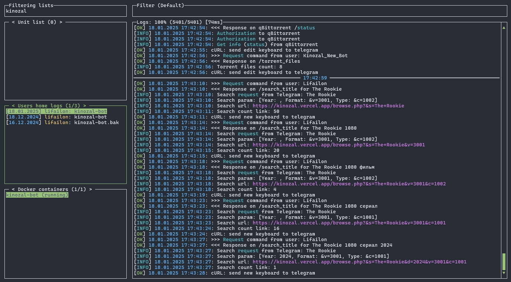
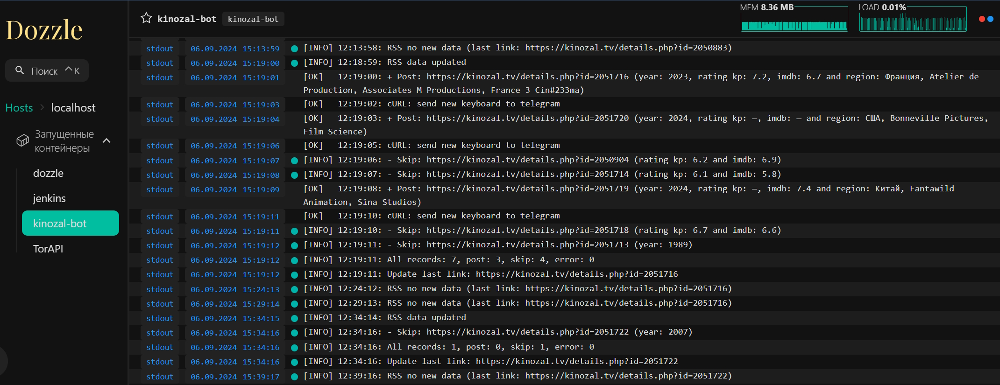

<h1 align="center">
    
    Kinozal Bot & News
    
</h1>

<p align="center">
    <a href="https://github.com/Lifailon/Kinozal-Bot"></a>
    <a href="https://github.com/Lifailon/Kinozal-Bot/releases"></a>
    <a href="https://github.com/Lifailon/Kinozal-Bot/blob/rsa/LICENSE"></a>
</p>

Telegram бот, который позволяет автоматизировать процесс доставки контента до вашего телевизора, используя только телефон.

С помощью бота вы получите удобный и привычный интерфейс для взаимодействия с торрент трекером [Кинозал](https://kinozal.tv) и базой данных [TMDB](https://www.themoviedb.org) для отслеживания даты выхода серий, сезонов и поиска актеров для каждой серии, а также возможность управлять торрент клиентом [qBittorrent](https://github.com/qbittorrent/qBittorrent) или [Transmission](https://github.com/transmission/transmission) на вашем компьютере, находясь удаленно от дома, а главное, все это доступно из единого интерфейса и без установки клиентского приложения на конечные устройства. В отличии от других приложений, предназначенных для удаленного управления торрент клиентами, вам не нужно находиться в той же локальной сети или использовать VPN.

Запустить бота возможно как службу **systemd** или в контейнере 🐳 **Docker** (рекомендуется). Вы можете настроить и управлять торрент клиентом независимо от настройки или работоспособности трекера *Кинозал*, или наоборот, использовать только интерфейс *Кинозал* для поиска раздач и выгрузки торрент файлов в Telegram.

На базе бота реализован новостной канала [Kinozal-News](https://t.me/kinozal_news), который генерирует посты на основе новых публикаций в торрент трекере *Кинозал* (современная альтернатива **RSS**). Каждый пост содержит краткую информацию о раздаче (год выхода, страна производства, рейтинг, качество и перевод), а также `#хештеги` по жанру для фильтрации контента на канале и кнопки с ссылками описания фильма или сериала в базах данных о кинематографе [Кинопоиск](https://www.kinopoisk.ru) и [IMDb](https://www.imdb.com), бесплатный онлайн просмотр через плееры ▶️ [Kinobox](https://kinobox.tv) и 🧲 [магнитные ссылки](https://en.wikipedia.org/wiki/Magnet_URI_scheme) для прямой загрузки содержимого раздачи в вашем торрент клиенте по умолчанию (применимо как для bittorrent-клиентов на телефоне, так и Windows или Linux).

Присоединяйтесь к каналу, что бы не пропускать новые публикации в трекере:

[](https://t.me/kinozal_news)

На канале присутствует фильтрация всех публикаций по рейтингу (**7.0** и выше), году выхода (**2024** и новее), региону и времени, а также на основе предыдущих публикаций (по названию и их размеру) для исключения дублирующихся раздач.

Или используйте публичную RSS ленту новостей из проекта [TorAPI](https://github.com/Lifailon/TorAPI/blob/main/README_RU.md) с поддержкой фильтрации:

[](https://torapi.vercel.app/api/get/rss/kinozal?category=0&year=0&format=0) [](https://app.swaggerhub.com/apis-docs/Lifailon/TorAPI/0.5.2#/RSS/get_api_get_rss_kinozal)

Для пользователей бота реализован сценарий публичного запуска зеркала на платформе **Vercel**:

[](https://github.com/Lifailon/Kinozal-Proxy)

---

### Документация:

- [📝 Статьи на Хабр](#-статьи-на-хабр)
- [💁‍♂️ Как это работает](#️-как-это-работает)
- [📚 Stack](#-stack)
- [🍿 Реализовано](#-реализовано)
- [🚀 Примеры использования](#-примеры-использования)
- [⚡ Зависимости](#-зависимости)
- [⚙️ Настройка](#️-настройка)
- [🔌 Подключение и управление](#-подключение-и-управление)
- [🐧 Служба (unit)](#-служба-unit)
- [🐳 Контейнер](#-контейнер)
  - [Docker](#docker)
  - [Podman](#podman)
  - [Мониторинг](#мониторинг)
- [📌 Меню бота](#-меню-бота)
- [🙋‍♂️ Список команд](#️-список-команд)
- [🎉 Другие проекты](#-другие-проекты)

---

## 📝 Статьи на Хабр

- [Telegram бот для доставки торрент контента с телефона до телевизора](https://habr.com/ru/articles/782028).

- [Telegram бот для управления торрент клиентом и интеграция с трекером](https://habr.com/ru/articles/826774).

- [Jackett и альтернативные решения (интерфейсы и api) для поиска торрентов](https://habr.com/ru/articles/841924).

## 💁‍♂️ Как это работает

Например, пока вы едите домой с работы, у вас появляется возможность подобрать фильм или сериал в обширной базе Кинозал прямиком с вашего телефона, или, найти что-то новое на канале [Kinozal-News](https://t.me/kinozal_news), после чего сразу загрузить выбранное на ваш компьютер и автоматически или через бот синхронизировать данные с [Plex Media Server](https://www.plex.tv/ru/media-server-downloads). По приходу домой, вам остается только открыть приложение Plex на вашем телевизоре и начать просмотр 📺🍿.


Такой подход также применим для передачи управления по подбору контента другому члену семьи (🐒), это особенно актуально, если у вас один компьютер, который может быть занят или к нему нет прямого доступа. Разобраться в интерфейсе бота проще, чем использовать все сервисы по отдельности, и главное, куда быстрее.

## 📚 Stack

- [Telegram REST api](https://core.telegram.org/bots/api)
- [qBittorrent WebUI api](https://github.com/qbittorrent/qBittorrent/wiki/WebUI-API-(qBittorrent-4.1))
- [Transmission RPC api](https://github.com/transmission/transmission/blob/main/docs/rpc-spec.md)
- [Plex Media Server api](https://github.com/plexinc) (не содержит официальной документации)
- [TMDB api](https://developer.themoviedb.org/reference/intro/getting-started)

**Зависимости:**

- [jqlang](https://github.com/jqlang/jq) для обработки данных в формате *json*
- Доступ в Кинозал и *TMDB* (*опционально*, ознакомьтесь со всеми возможными вариантами получения доступа в [настройках](#️-настройка))

Серверная часть написана на чистом [Bash](https://ru.wikipedia.org/wiki/Bash) и использует стандартный набор Unix-утилит.

Бот протестирован и работает в виртуальной среде *Hyper-V* на системе *Ubuntu Server 20.04* и новее (возможен запуск в системе Windows через интерпретатор [Git Bash](https://git-scm.com/downloads/win)) для удаленного управления приложениями, установленные в домашней системе Windows или Linux*. Хранение торрент-файлов происходит в системе, на которой запущен бот.

> \* Проверка удаленного управления приложениями на системе Linux не произодилась. Так как весь стек приложений является кросс-платформенным и имеет единую схему для удаленного взаимодействия через `API`, все должно (и будет) работать точно также.

## 🍿 Реализовано

- ✅ Интерфейс для взаимодействия с торрент трекером **[Кинозал](https://kinozal.tv)**. Поиск раздач с фильтрацией по году выхода и формату разрешения (*HD/FullDH/4K*), подробная информации о каждой раздачи, содержимое раздачи, загрузка торрент файлов, поиск актеров и получение его фильмографии.
- ✅ Централизованное управление загруженными торрент файлами (*.torrent*) на сервере, с возможностью выгрузки в Telegram.
- ✅ Интерфейс удаленного управления торрент клиентом [qBittorrent](https://github.com/qbittorrent/qBittorrent). Добавление раздач на загрузку из торрент файла, [инфо хеш](https://en.wikipedia.org/wiki/Magnet_URI_scheme) (передается в каждой публикации новостного канала и при поиске раздач в боте) а также через url торрент файла, получение подробной информации о загрузке (скорость загрузки, статус, пиры, сиды и т.д.), пауза и возобновление загрузки, проверка на целостность, принудительно анонсировать, переключение лимитов скорости, управление приоритетом отдельных файлов, удаление торрента и содержимого раздачи из системы.
- ✅ Интерфейс управления торрент клиентом [Transmission](https://github.com/transmission/transmission). Добавление раздач на загрузку из торрент файла, инфо хеш или url, получение подробной информации о загрузке, пауза и возобновление загрузки, управление приоритетом отдельных файлов, удаление торрента и содержимого раздачи.
- ✅ Синхронизация контента с [Plex Media Server](https://www.plex.tv), а также просмотр содержимого директорий и дочерних файлов.
- ✅ Получение дополнительной информации о фильме и сериале из [The Movie Database](https://www.themoviedb.org/?language=ru) (TMDB). Список актеров и сезонов для каждого сериала, список серий в каждом сезоне, дата выхода сезонов и серий, а также получение подробной информации о каждой серии и список приглашенных актеров.

Добавление торрента по 🧲 *hash*-сумме и 🌐 *url*-адресу торрент файла (без загрузки самого файла) возможно из любого источника (торрент трекера). По мимо загрузки, это также дает возможность сформировать и сохранить торрент файл на сервере с полученными метаданными через торрент клиент qBittorrent или Transmission, который можно выгрузкой в Telegram, для дальнейшей загрузки через ваш торрент клиент на телефоне.

---

## 🚀 Примеры использования

- Загрузка раздачи из канала по 🧲 магнитной ссылки (переадресация происходит автоматически в торрент клиент по умолчанию):

<h1 align="center">
    </a> </a>
</h1>

💡 Так как параметр url в [keyboard Telegram API](https://core.telegram.org/bots/api#inlinekeyboardmarkup) не поддерживает magnet-ссылки, был реалезован механизм переадресации через [magnet2url](https://github.com/Lifailon/magnet2url), который также добавляет в ссылку список актуальных серверов торрент трекеров, используемых в Кинозал, а также WebTorrent, RuTracker, NoNameClub и RuTor.

Быстрее всего (в течение 1-2 секунд с момента перехода по ссылке) метаданные загружает локальный клиент [LibreTorrent](https://github.com/proninyaroslav/libretorrent) на Android и клиент [WebTorrent Desktop](https://github.com/webtorrent/webtorrent-desktop) или [WebTorrent Desktop api](https://github.com/Lifailon/webtorrent-desktop-api) на Windows, в то время как qBittorrent и Transmission может понадобиться до нескольки минут, а также загрузка может происходить медленнее. Для решения такой проблемы, может помочь запрос большего количества участников у торрент трекера (повторно анонсировать, доступно для клиента qBittorrent).

<h1 align="center">
    </a>
</h1>

- Демонстрация работы поиска и добавление на загрузку в qBittorrent (**версия 0.4.4**):

> Скорость получения информации из трекера Кинозал на прямую зависит от скорости работы вашего интернета и/или VPN соединения. При этом, скорость ответов бота при запуске в контейнере (добавлено в **версии 0.4.6**) в моей системе увеличилась примерно в два раза.

<h1 align="center">
    </a>
</h1>

- 🔍 Поиск в торрент трекере c фильтрацией по году выхода и формату разрешения:

<h1 align="center">
    </a> </a>
</h1>

- 👤 Профиль Кинозал, список торрент файлов на сервере и выгрузка всех торрент файлов (с полученными метаданными) в Telegram:

<h1 align="center">
    </a> </a>
</h1>

- 🍿 Получение информации о выбранном сериале в Кинозал (стандартный вывод для всех раздач, из данного интерфейса происходит управление выбранным торрент файлом), а также пример управления загрузкой в клиенте 🔳 Transmission:

<h1 align="center">
    </a> </a>
</h1>

- 👥 Поиск по актеру в трекере Кинозал и список фильмов с его участием, а также получение дополнительной информации из базы 💙 TMDB и даты выхода всех сезонов и серий:

<h1 align="center">
    </a> </a>
</h1>

- 🐸 Список и статус всех активных торрентов, добавленных в клиент qBittorrent, а также получение дополнительной информации и управление загрукой файлов:

<h1 align="center">
    </a> </a>
</h1>

- 🟠 Список секций и синхронизация контента, а также просмотр содержимого файлов на сервере Plex:

<h1 align="center">
    </a> </a>
</h1>

---

## ⚡ Зависимости

Установите **[jq](https://github.com/jqlang/jq)**:

```shell
apt install jq
jq --version
jq-1.6
```

Также, вы можете проверить, что в вашей системе установлен интерпритатор `bash` и следующие пакеты (предустановлены по умолчанию в большинстве дистрибутивов Linux): `curl`, `grep`, `sed`, `gawk`, `tail`, используя параметр `--version`.

```shell
bash --version
GNU bash, version 5.1.16(1)-release (x86_64-pc-linux-gnu)
```

Для запуска бота необходимо загрузить скрипт `kinozal-bot.sh` и конфигурационный файл `kinozal-bot.conf`, который располагается рядом со скриптом.

```shell
# Создаем директорию для скрипта и хранения сопутствующих файлов в процессе работы
cd ~
mkdir kinozal-bot
# Клонируем репозиторий
git clone https://github.com/Lifailon/Kinozal-Bot
# Копируем скрипт и файл конфигурации
cp Kinozal-Bot/scripts/kinozal-bot.sh kinozal-bot
cp Kinozal-Bot/scripts/kinozal-bot.conf kinozal-bot
# Удаляем остальные файлы проекта
rm -r Kinozal-Bot
# Переходим в директорию с конфигурацией для ее редактирования
cd kinozal-bot
```

В примере используется директория `kinozal-bot` в корне домашнего каталога текущего пользователя.

Так выглядит состав файлов на рабочем экземпляре:

<h1 align="center">
    </a>
</h1>

## ⚙️ Настройка

Для работы бота, необходимо подготовить свою домашнюю среду, все настройки подключения задаются в конфигурационном файле: 📑 **[kinozal-bot.conf](https://github.com/Lifailon/Kinozal-Bot/blob/rsa/scripts/kinozal-bot.conf)**.

Возможно, у вас уже подготовлены все настройки для управления и вам достаточно только заполнить конфигурацию. Для редактирования, вы можете воспользоваться любым встроенным консольным редактором, например, `nano kinozal-bot.conf` или [WinSCP](https://winscp.net/eng/download.php).

💡 Имея уже подготовленный файл, можно очень быстро перезапустить бота на любой другой машине в домашней сети.

1. Зарегистрируйте аккаунт на сайте *[Кинозал](https://kinozal.tv)* и заполнить параметры конфигурации:

`KZ_PROFILE="id_you_profile"` - идентификатор вашего профиля (используется для получения информации из профиля Кинозал) \
`KZ_USER="LOGIN"` - логин (используется на этапе получения инфо хэш из раздачи, содержимого раздачи и загрузки торрент-файлов) \
`KZ_PASS="PASSWORD"` - пароль

2. Если у вас заблокирован доступ в *Кинозал*, вы можете воспользоваться VPN или Proxy сервером, через который бот сможет проксировать свои запросы.

Я использую **HandyCache (Proxy)** в системе *Windows*, рядом с которым запущена бесплатная версия *VPN Hotspot Shield* в режиме **Split Tunneling** до сайта Кинозал (в таком режиме не будет доступен сервис *TMDB API*), при котором трафик до указанного сайта проходит через VPN туннель и не затрагивает другие сервисы, тем самым не ограничивая загрузку торрентов на хостовой машине.

> Вы также можете настроить выделенную виртуальную машину для подобного стэка, и даже добавить в него *Wi-Fi* модуль для организации второй домашней сети без необходимости использовать раздельное туннелирование.

- 2.1. Настройка Proxy-сервера:

`PROXY="True"` - включить использование прокси сервера в curl-запросах при обращении к Кинозал и TMDB \
`PROXY_ADDR="http://192.168.3.100:9090"` - адрес сервера и порт, на котором слушает запросы Proxy-сервер \
`PROXY_USER="LOGIN"` \
`PROXY_PASS="PASSWORD"`

- Для удаленного управления VPN-соединением в системе Windows реализован проект [vpnc](https://github.com/Lifailon/vpnc) и интегрирован бот.

Для запуска и настройки, следуйте инструкциям на [странице проекта](https://github.com/Lifailon/vpnc/blob/main/README_ru.md). После того, как у вас будет настроена конфигурация и запущен исполняемый файл (который может быть добавлен в автозагрузку), заполните параметр адреса сервера:

`VPNC_ADDR="http://192.168.3.100:1780"`

Данное решение актуально только в том случае, если ваш клиент запущен на одной машине с другими сервисами (и поддерживает автоподключение при запуске) и не используется режим раздельного туннелирования. Такой подход удобен в первую очередь для отключения соединения на время загрузки файлов большого объема.

- 2.2. Поддерживается использования обратного прокси сервера, на котором есть прямой доступ к трекеру, например, через [froxy](https://github.com/Lifailon/froxy):

Загрузите [исполняемый файл](https://github.com/Lifailon/froxy/releases) и запустите обратный прокси сервер на машине с доступом к Кинозал:

```
froxy --local 192.168.3.100:8443 --remote https://kinozal.tv
```

Или запустите в контейнере:

```shell
docker pull lifailon/froxy:latest
docker run -d --name froxy -e SOCKS=0 -e FORWARD=0 -e LOCAL="*:8443" -e REMOTE="https://kinozal.tv" -e USER="false" -e PASSWORD="false" -p 8443:8443 --restart=unless-stopped lifailon/froxy
```

Отключите в конфигурации использование Proxy-сервера и замените адрес Кинозал на адрес обратного прокси сервера:

`PROXY="False"` \
`KZ_ADDR="http://192.168.3.100:8443"`

Вы можете ознакомиться на странице [репозитория](https://github.com/Lifailon/froxy/blob/main/README_RU.md), что такое обратный прокси сервер и какие задачи он решает.

- 2.3. Также возможно развернуть свое публичное зеркало с использованием **функции serverless** на базе `Next.js` для доступа к трекеру без использования VPN.

> Рекомендуется запустить свое приложение из исходного репозитория [Kinozal-Proxy](https://github.com/Lifailon/Kinozal-Proxy), во избежании излишней нагрузки на один экземпляр сервера и сохранности ваших авторизационных данных в трекере.

Для этого, вопользуйтесь кнопкой ниже и следуйте инструкциям:

[](https://vercel.com/new/torapi/clone?repository-url=https://github.com/lifailon/Kinozal-Proxy)

3. Создайте своего Telegram бота через **[@BotFather](https://t.me/BotFather)** используя интуитивно понятный интерфейс и получите API-токен доступа. Что бы получить ваш **чат id**, напишите любое сообщение вашему боту и перешлите его **[Get My ID](https://t.me/getmyid_arel_bot)**, после чего заполните параметры:

`TG_TOKEN="6873341222:AAFnVgfavenjwbKutRwROQQBya_XXXXXXXX"` - используется для чтения и отправки сообщений ботом \
`TG_CHAT="8888888888,999999999"` - id всех чатов, которые будут иметь доступа к боту

> По мимо этого, id можно получить в логе работы бота из запросов новых клиентов (`>>> Request`), которые вы сможете добавить в конфигурацию через запятую.

4. [Установите](https://www.qbittorrent.org/download) и настройте торрент клиент *qBittorrent*.

- 4.1. Включите **Веб-интерфейс** в настройках приложения:

<h1 align="center">
    </a>
</h1>

Укажите параметры подключения к клиенту:

`QB_ADDR="http://192.168.3.100:8888"` - указать URL-адрес, где указан протокол (по умолчанию, **http**), ip-адрес машины, на которой запущен qBittorrent и порт (задается в настройках **Веб-интерфейса**) \
`QB_USER="LOGIN"` - имя пользователя, указывается в поле **Аутентификация** в настройках **Веб-интерфейса** \
`QB_PASS="PASSWORD"` - пароль, указывается в поле **Аутентификация** в настройках **Веб-интерфейса**

- 4.2. Определите директорию для загрузки контента в *qBittorrent* по умолчанию. 

💡 Это должна быть директория, которая будет добавлена на сервер Plex, что бы в дальнейшем можно было синхронизировать загруженный контент, используя бот.

<h1 align="center">
    </a>
</h1>

5. [Установите](https://transmissionbt.com/download) и настройте *Transmission* для управления клиентом с помощью бота:

<h1 align="center">
    </a>
</h1>

Укажите параметры подключения к клиенту:

```shell
TRANS_ADDR="http://192.168.3.100:9091"
TRANS_USER="LOGIN"
TRANS_PASS="PASSWORD"
```

Возможно использовать как один, так и оба торрент клиентов для синхронизации с сервером Plex.

☁️ Вы также можете настроить **второй клиент для синхронизации с любым облачным хранилищем**, что бы иметь удаленный доступ к файлам, например, с телефона, т.к. для удаленного непрерывного просмотра или загрузки контента с локального сервера Plex **требуется подписка [Plex Pass](https://www.plex.tv/plex-pass)**. Для этого укажите любую дочернюю директорию внутри вашего облачного хранилища (необходимо, что бы ваше облако было подключено к файловой системе компьютера) для загрузки контента в клиенте *Transmission* (или *qBittorrent*) по умолчанию. После загрузки контента, вы сможете получить к нему доступ на любом удаленном устройстве в режиме онлайн или для загрузки, без необходимости ожидания сидов или пиров.

6. Установите [Plex Media Server](https://www.plex.tv/ru/media-server-downloads/?cat=computer&plat=windows) и [получите токен доступа](https://support.plex.tv/articles/204059436-finding-an-authentication-token-x-plex-token).

Так как нет возможности напрямую получить токент доступа в веб-интерфейсе, можно воспользоваться панелью разработчика в браузере. Откройте [Development Tools](https://developer.chrome.com/docs/devtools?hl=ru) нажатием кнопки `F12` и перейдите на вкладку **сеть (network)**, обновите страницу интерфейса вашего сервера Plex, после чего вы сможете увидеть токен в любом из url-запросов (X-Plex-Token=**ваш_токена**). Передайте адрес сервера (по умолчанию, порт **32400**) и содержимое токена в параметры:

```shell
PLEX_ADDR="http://192.168.3.100:32400"
PLEX_TOKEN="ваш_токена"
```

<h1 align="center">
</a>
</h1>

💡 Создайте новую секцию на сервере Plex и укажите путь к директории хранения вашего контента, на которую **уже настроен** (п.4 и п.5) клиент *qBittorrent* или *Transmission* **по умолчанию**:

<h1 align="center">
</a>
</h1>

7. Настройка подключения к [TMDB](https://www.themoviedb.org):

💡 Как и в случае с настройкой второго торрент клиента, данный пункт является *опциональным*.

[Зарегестрируйте аккаунт](https://www.themoviedb.org/signup) на сайте **The Movie Database** и [выпустите ключ доступа](https://www.themoviedb.org/settings/api) к api, после чего заполните параметры конфигурации (возможно указать ключ или токен на выбор):

```
TMDB_KEY="XXXXXXXXXXXXXXXXXXXXXXXXXXXXXXXX"
TMDB_TOKEN="XXXXXXXXXXXXXXXXXXXX.XXXXXXXXXXXXXXXXXXXX.XXXXXXXXXXXXXXXXXXXX"
```

8. Путь для хранения торрент файлов, *cookie* (временные файлы, которые используются для авторизации в *Кинозал* и *qBittorrent*), а также лог-файлов и его размер (поддерживается ротация) на сервере **задаются в конфигурации**:

```shell
# /home/<username>/kinozal-bot
path="/home/lifailon/kinozal-bot"
# Путь при запуске в контейнере
# path="/kinozal-bot"
log_size_mbyte=10
```

Все запросы к боту, а также его ответы логируются.

## 🔌 Подключение и управление

Перед запуском, вы можете проверить подключение к сервисам, в случае успеха, вы получите текущую версию приложения:

```shell
cd ~/kinozal-bot
bash kinozal-bot.sh version

qBittorrent Client:  4.6.5 (api: 2.9.3)
Transmission Client: 4.0.6 (38c164933e)
Plex Media Server:   1.40.0.7998-c29d4c0c8
```

- Используйте интерпретатор **Bash** для запуска (**root** права не требуются):

```shell
bash kinozal-bot.sh start bot
```

- Узнать статус работы и количество активных процессов:

```shell
bash kinozal-bot.sh status

[INFO] 14:38:46: Server running. Count running process: 4
```

- Проверка подключения к *qBittorrent*:

Если настройки заданы правильно, вы можете отобразить журнал работы *qBittorrent* клиента в своей консоли:

```shell
bash kinozal-bot.sh log qb
bash kinozal-bot.sh log qb all
```

- Отобразить журнал работы системы и сервера *Plex*:

```shell
bash kinozal-bot.sh log plex system
bash kinozal-bot.sh log plex system all
bash kinozal-bot.sh log plex server
bash kinozal-bot.sh log plex server all
```

- Вывести журнал работы бота:

```shell
bash kinozal-bot.sh log bot   
bash kinozal-bot.sh log bot 50
```

- Остановка бота и всех его дочерних процессов:

```shell
bash kinozal-bot.sh stop
bash kinozal-bot.sh status

[INFO] 14:40:16: Server not running. Count running process: 0
```

## 🐧 Служба (unit)

> Вы можете пропустить этот шаг и запустить бота в контейнере 🐳 [Docker](#-docker)

Если все настройки заданы и подключение проверено, можно запустить бота как службу (*unit*) **systemd**, что бы автоматизировать процесс запуска в случае перезагрузки системы, а также передать поток логов в системный журнал (удобно для удаленного мониторинга, например, через `rsyslog` в [Graylog](https://github.com/Graylog2/graylog2-server)).

- Создайте файл службы и откройте его в любом текстовом редакторе:

```
touch /etc/systemd/system/kinozal-bot.service
nano /etc/systemd/system/kinozal-bot.service
```

- Скопируйте в файл следующее [содержимое](https://github.com/Lifailon/Kinozal-Bot/blob/rsa/scripts/kinozal-bot.service):

```
[Unit]
Description=Telegram bot for kinozal.tv torrent tracker, remote managment qBittorrent and Plex Media Server
After=network.target

[Service]
ExecStart=/bin/bash "/home/lifailon/kinozal-bot/kinozal-bot.sh" start bot service
ExecReload=/bin/kill -HUP $MAINPID
Restart=on-failure
Type=forking

[Install]
WantedBy=multi-user.target
```

💡 Замените путь к скрипту сервера в параметре запуска `ExecStart` на свой.

- Примените настройки, включите автозапуск и запустите службу:

```shell
systemctl daemon-reload
systemctl enable kinozal-bot
systemctl start kinozal-bot
systemctl status kinozal-bot
```

После этого возможно управлять запуском, используя команды: `start`, `stop` и `restart`.

Для просмотра журнала работы бота, можете использовать утилиту `journalctl`:

```shell
journalctl -fu kinozal-bot
```

## 🐳 Контейнер

Запуск в контейнере является альтернативой настройки службы `systemd`. Обработка ответов происходит заметно быстрее (сравнительно с локальным запуском на малопроизводительных системах), по этому такой способ является **рекомендуемым**.

- Перейдите в директорию со скриптом и **настроенным** файлом конфигурации:

```shell
cd ~/kinozal-bot
```

- Создайте [dockerfile](https://github.com/Lifailon/Kinozal-Bot/blob/rsa/dockerfile) с содержимым:

```dockerfile
FROM alpine:latest
WORKDIR /kinozal-bot
RUN apk add --no-cache bash coreutils curl grep sed gawk jq tzdata
ENV TZ=Etc/GMT-3
RUN ln -snf /usr/share/zoneinfo/$TZ /etc/localtime && echo $TZ > /etc/timezone
COPY kinozal-bot.sh .
RUN chmod +x kinozal-bot.sh
ENTRYPOINT ["bash", "-c", "./kinozal-bot.sh start bot docker"]
```

### Docker

Соберите образ и запустите контейнер в Docker:

```shell
docker build -t kinozal-bot .
docker run -d \
    --name kinozal-bot \
    --restart=unless-stopped \
    --label com.centurylinklabs.watchtower.enable=false \
    -v ./torrents:/kinozal-bot/torrents \
    kinozal-bot
```

Или загрузите образ из [Docker Hub](https://hub.docker.com/r/lifailon/kinozal-bot):

```shell
docker run -d \
    --name kinozal-bot \
    --restart=unless-stopped \
    -v ./torrents:/kinozal-bot/torrents \
    -v ./kinozal-bot.conf:/kinozal-bot/kinozal-bot.conf \
    lifailon/kinozal-bot:latest
```

Размер образа составляет 20 МБайт. Режим `unless-stopped` отвечает за перезапуск контейнера в случае перезагрузки системы или другого сбоя, за исключением ручной остановки.

При создании контейнера используется механизм **bind mount** (`-v` `путь в системе`**:**`путь в контейнере`), это удобно для синхронизации и хранения торрент файлов (`.torrent`) с локальной системой, тем самым при запуске бота в контейнере или локальной системе будет доступ к одному и томуже составу торрент файлов, а после удаления контейнера и образа файлы будут сохранены в системе.

### Podman

Так как бот для своей работы не требует прав `root` (использование команды `sudo`), то вы можете запустить контейнер в [Podman](https://github.com/containers/podman):

```shell
podman build -f dockerfile -t kinozal-bot .
podman run -d \
    --name kinozal-bot \
    -v ./torrents:/kinozal-bot/torrents \
    kinozal-bot
```

Так как *Podman* не использует службы для своей работы, для автоматического запуска бота при перезагрузке системы возможно создать пользовательскую службу:

```shell
# Остановить контейнер
podman stop kinozal-bot
# Скопируйте содержимое службы из GitHub
mkdir -p ~/.config/systemd/user && touch ~/.config/systemd/user/kinozal-bot-podman.service
curl -s "https://raw.githubusercontent.com/Lifailon/Kinozal-Bot/refs/heads/rsa/scripts/kinozal-bot-podman.service" > ~/.config/systemd/user/kinozal-bot-podman.service
# Запустить службу и проверить работу контейнера
systemctl --user start kinozal-bot-podman.service
podman ps
# Включить поддержку пользовательских служб и добавить в автозагрузку
loginctl enable-linger $(whoami)
systemctl --user enable kinozal-bot-podman.service
```

### Мониторинг

Вы можете управлять запуском контейнара с помощью команд:

```shell
<docker/podman> <start/restart/stop> kinozal-bot
```

Для просмотра журналов контейнера используется команда: `<docker/podman> logs kinozal-bot`.

Что бы не вызывать каждый раз команду `logs` для просмотра логов контейнера или других журналов, установите терминальный пользовательский интерфейс [lazyjournal](https://github.com/Lifailon/lazyjournal) для быстрого мониторинга и фильтрации логов контейнеров *Docker* и *Podman*, юнитов `systemd` или лог-файлов в системе.

Пример чтения локального файла `kinozal-bot.log`:



> В примере используются запросы с разными фильтрами для поиска в базе Кинозал.

Для мониторинга журналов контейнеров через веб-интерфейс, используйте [Dozzle](https://github.com/amir20/dozzle).



Команда для быстрого удаления контейнера и образа:

```shell
docker stop kinozal-bot && docker rm kinozal-bot && docker rmi kinozal-bot && docker rmi alpine || docker rmi lifailon/kinozal-bot:latest
```

<!--
Вы также можете сохранить образ контейнера с помощью одной команды. Это удобно, в случае переустановки системы или переноса бота на другую машину (больше не понадобится заполнять конфигурацию и собирать образ заново):

```shell
docker save -o kinozal-bot.tar kinozal-bot
```

На другой системе необходимо только загрузить файл образа и запустить контейнер:

```shell
docker load -i kinozal-bot.tar
docker run -d --name kinozal-bot --restart=unless-stopped kinozal-bot
```
-->

## 📌 Меню бота

Что бы создать и закрепить список основных команд для быстрого вызова через меню бота, перейдите в управление вашим ботом через **[BotFather](https://t.me/BotFather)**, выберите `Edit Bot` и настройте список команд с помощью `Edit commands`. Передайте список команд, как на примере ниже (вы можете изменить список команд, как и их описание на свое усмотрение):

```
search_id - 🔎 Поиск в Кинозал по id
search_title - 🍿 Поиск по названию
search_actor - 👥 Поиск по актеру
research - 🔄 Повторить последний поиск
torrent_files - 🗂 Торрент файлы
status - 🟢 qBittorrent
trans_status - 🔲 Transmission
add_torrent - ➕🧲 Добавить торрент по инфо хеш
add_url - ➕🌐 Добавить торрент по url-адресу
plex_info - 🟠 Plex
find - 🔍 Поиск в Plex
vpnc_status - 🛡 VPN
```

Слева от поля ввода текста в интерфейсе вашего бота появится меню для быстрого вызова команд, которые возможно выбирать (для вставки текстом в поле ввода) с помощью кнопки `Tab`, или продолжительным нажатием через мобильный интерфейс.

---

## 🙋‍♂️ Список команд

Список всех доступных команд (за исключением `/search_title`, `/search_actor`, `/add_hash` и `/add_url`) **автоматизирован** через меню интерфейса бота с помощью кнопок.

`/search_title` - Поиск в Кинозал по названию (вначале запроса принимает год выхода для фильтрации) \
`/profile` - Профиль Кинозал (количество доступных для загрузки торрент файлов, статистика загрузки и отдачи, время сид и пир) \
`/torrent_files` - Список загруженных торрент файлов с возможностью удаления \
`/status` -  список и статус всех текущих торрентов, добавленных в торрент-клиент qBittorrent \
`/plex_info` - Список секций на сервере Plex для доступа к их контенту \
`/download_torrent <id> <file_name>` - Загрузить торрент файл (передать два параметра: id и имя файла без пробелов) \
`/delete_torrent_file_<id>` - Удалить торрент файл по id \
`/search_id <id>` - Поиск в Кинозал по id \
`/download_video_<id>` - Добавить торрент файла на загрузку в qBittorrent \
`/info <hash>` - Статус загрузки указанного торрента (передать параметр: hash торрента) \
`/torrent_content <hash>` - Содержимое торрента (список файлов) \
`/file_torrent <index>` - Статус выбранного торрент файла (передать параметр: порядковый индекс файла) \
`/torrent_priority <num>` - Изменить приоритет выбранного файла в /file_torrent (передать параметр: номер приоритета) \
`/pause <hash>` - Установить на паузу \
`/resume <hash>` - Восстановить загрузку \
`/delete_torrent <hash>` - Удалить торрент из клиента \
`/delete_video <hash>` - Удалить вместе с данными \
`/plex_status_<key>` - Информация о выбранной секции в Plex (передать параметр: ключ секции) \
`/plex_sync_<key>` - Синхронизировать выбранную секцию в Plex \
`/plex_folder_<key>` - Получить список директорий и файлов в выбранной секции \
`/find` - Поиск контента в Plex по пути (передать параметр: конечную точку)

- Добавлено в версии 0.4.1:

`/plex_last_views` - Список последних просмотров (дата просмотра и время остановки) в Plex \
`/plex_last_added` - Список последних добавленных файлов в Plex \
`/kinozal_description <id>` - Описание фильма из Кинозал (удалено из меню в версии 0.4.5)

- Добавлено в версии 0.4.2:

`/kinozal_actors <id>` - Список актеров из Кинозал (передать параметр: id kinozal) \
`/actor <id>` - Описание, поиск актера и его фильмографии из Кинозала и ссылка на Кинопоиск (передать параметр: имя актера) \
`/kinopoisk_movie <id>` - Информация о фильме из Кинопоиск по id kinopoisk (удалено из меню в версии 0.4.5)

- Добавлено в версии 0.4.3:

Поддержка [WinAPI](https://github.com/Lifailon/WinAPI) (временно отключено в версии 0.4.4).

- Добавлено в версии 0.4.4:

`/search_title <year*> <format*> <title>` - Поиск с фильтрацией по году выхода и формату разрешения \
`/research` - Повторить последний поиск (id не требуется) \
`/file_list` - Извлечь список файлов и их размер из раздачи \
`/send_torrent_file_id` - Отправка загруженного торрент-файла в Telegram \
`/send_last_torrent_file` - Отправить последний загруженный торрент-файл \
`/send_all_torrent_files` - Отправить все загруженные торрент-файлы \
`/skip_all_files <hash>` - Пропустить загрузку всех файлов путем изменения приоритета в qBittorrent \
`/normal_all_files <hash>` - Восстановить загрузку всех файлов \
`/add_torrent <hash>` - Добавить раздачу на загрузку в qBittorrent по инфо хэш \
`/get_torrent <hash>` - Выгрузить торрент файл на сервер по инфо хэш и отправить в телеграмм \
`/torrent_recheck <hash>` - Проверить торрент файл \
`/torrent_limit` - Переключить альтернативные лимиты скорости загрузки и отдачи

- Добавлено в версии 0.4.5:

`/search_actor <name>` - Поиск актеров в базе Кинозал (возвращает список найденных актеров) \
`/actor <search/list> <name>` - Первый параметр принимает тип возврата (`/kinozal_actors` или `/search_actor`) \
`/trans_status` - Список и статус всез торрент в клиенте Transmission \
`/trans_info <id>` - Получить подробную информацию о торренте \
`/trans_file_all <id> <skip/resume>` - Изменить приоритет загрузки всех торрент файлов выбранной раздачи по id (пропустить или возобновить загрузку и выставить нормальный приоритет) \
`/trans_file_select <id> <file_index>` - Переключить приоритет выбранного файла (пропустить или высокий приоритет) \
`/trans_pause <id> <start/stop>` - установить на паузу или возобновить \
`/trans_remove <id> <false/true>` - удалить торрент и данные \
`/trans_set_alt_speed` - переключить лимит альтернативной скорости \
`/add_hash <qbit/trans> <hash>` - Добавить торрент по инфо хеш в указанный клиент \
`/download_trans_<id>` - Добавить торрент файла на загрузку в Transmission клиент \
`/add_url <url>` - Добавить торрент по url-адресу с выбором клиента через меню \
`/add_trans_url <url>` - Добавить торрент по url-адресу в Transmission клиент \
`/add_qbit_url <url>` - Добавить торрент по url-адресу в qBittorrent клиент \
`/torrent_reannounce <hash/all>` - Принудительно повторно анонсировать (запросить у трекера больше участников) для выбранного торрента в qBittorrent клиенте \
`/tmdb_info <kinozal_id>` - Получить информацию о фильме или сериале через TMDB API \
`/tmdb_actor <tmdb_id> <type>` - Получить список актеров \
`/tmdb_season_episodes <tmdb_id> <season_number>` - Список серий в указанном сезоне \
`/tmdb_select_episode <tmdb_id> <season_number> <episode_number>` - Информация по выбранной серии и список приглашенных актеров \
`/tmdb_person <person_id>` - Информация по актеру и ссылки на TMDB и IMDb

---

**Примеры запросов:**


- 🔍 Поиск в Кинозал по id:

`/search_id 1940284`

- 🍿 Поиск по названию фильма или сериала:

`/search_title Рокки 2` \
`/search_title Рокки 4`

- Поиск с фильтрацией по типу (фильм или сериал):

`/search_title Рокки 2 фильм`

- Поиск фильмов с фильтрацией по году выхода:

`/search_title 1979 Рокки фильм` \
`/search_title Рокки 1985 фильм`

- Поиск фильмов с фильтрацией по году выхода и формату разрешения (`HD`, `FullHD` или `4K`):

`/search_title Рокки фильм 1979 720` \
`/search_title Рокки фильм 1979 1080` \
`/search_title Рокки фильм 1979 2160`

- 👥 Поиск актера по имени в базе Кинозал:

`/search_actor "Алан"` \
`/search_actor "Сильвестр"`

- Получить биографию и фильмографию указанного актера:

`/actor search Алан Тьюдик` \
`/actor list Сильвестр Сталлоне`

- 🔄Повторить последний запрос поиска для фильма/сериала или актера:

`/research`

- 🧲 Добавить торрент по инфо хеш на загрузку с выбором клиента через меню:

`/add_torrent A72BD27A0CE265A3C7965392BC06C25EDD759214`

- 🧲 Добавить торрент по инфо хеш в указанный торрент клиент:

`/add_hash qbit A72BD27A0CE265A3C7965392BC06C25EDD759214` \
`/add_hash trans A72BD27A0CE265A3C7965392BC06C25EDD759214`

- 🌐 Добавить торрент по url-адресу с выбором клиента через меню:

`/add_url https://d.rutor.info/download/869858` \
`/add_url https://nnmclub.to/forum/download.php?id=1308422`

- 🔳 Добавить торрент в Transmission клиент:

`/add_trans_url https://d.rutor.info/download/869858`

- 🐸 Добавить торрент в qBittorrent клиент:

`/add_qbit_url https://nnmclub.to/forum/download.php?id=1308422`

---

## 🎉 Другие проекты

- ✨ [TorAPI](https://github.com/Lifailon/TorAPI/blob/main/README_RU.md) - неофициальный и публичный API (**backend**) для торрент трекеров RuTracker, Kinozal, RuTor и NoNameClub. Используется для быстрого и централизованного поиска раздач, получения торрент файлов, магнитных ссылок и подробной информации о раздаче по названию фильма, сериала или идентификатору раздачи, а также предоставляет новостную RSS ленту для всех провайдеров с фильтрацией по категориям.

- 🔎 [LibreKinopoisk](https://github.com/Lifailon/LibreKinopoisk) - расширение для Google Chrome, [Mozilla Firefox](https://addons.mozilla.org/ru/firefox/addon/librekinopoisk) и мобильных устройств, которое добавляет кнопки на сайт [Кинопоиск](http://kinopoisk.ru) и в контекстное меню браузера, а также реализует интерфейс [TorAPI](https://github.com/Lifailon/TorAPI) для быстрого поиска фильмов и сериалов в открытых источниках в стиле [Jackett](https://github.com/Jackett/Jackett) без необходимости в VPN и настройки сервера.

- 📖 [lazyjournal](https://github.com/Lifailon/lazyjournal) - терминальный пользовательский интерфейс для `journalctl` (инструмент для чтения логов из системы [systemd-journald](https://github.com/systemd/systemd/tree/main/src/journal)), логов в файловой системе (включая архивные, например, `Apache` или `Nginx`), а также контейнеров `Docker` и `Podman` для быстрого просмотра и фильтрации в режиме реального времени с поддержкой нечеткого поиска, регулярных выражений (в стиле `fzf` и `grep`) и покраской вывода, написанный на языке `Go` с использованием библиотеки [gocui](https://github.com/awesome-gocui/gocui).

- 📡 [Froxy](https://github.com/Lifailon/froxy/blob/main/README_RU.md) - кроссплатформенная утилита командной строки для реализации SOCKS, HTTP и обратного прокси сервера на базе **.NET**. Поддерживается протокол **SOCKS5** для туннелирования TCP трафика и **HTTP** протокол для прямого (классического) проксирования любого **HTTPS** трафика (`CONNECT` запросы), а также **TCP**, **UDP** и **HTTP/HTTPS** протоколы для обратоного проксирования. Для переадресации веб-траффика через обратный прокси поддерживаются `GET` и `POST` запросы с передачей заголовков и тела запроса от клиента, что позволяет использовать `API` запросы и проходить авторизацию на сайтах (передача cookie).

- 🛡 [VPNc](https://github.com/Lifailon/vpnc/blob/main/README_ru.md) - универсальный инструмент для автоматического (локального) и удаленного управления VPN соединением через настольное приложение (системный трей) и `API` на базе `ASP.NET Core`.

- ❤️ [WebTorrent Desktop api](https://github.com/Lifailon/webtorrent-desktop-api) - форк клиента [WebTorrent Desktop](https://github.com/webtorrent/webtorrent-desktop), в котором добавлен механизм удаленного управления через `API` на базе [Express.js Framework](https://github.com/expressjs/express).